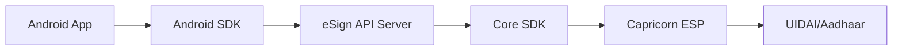
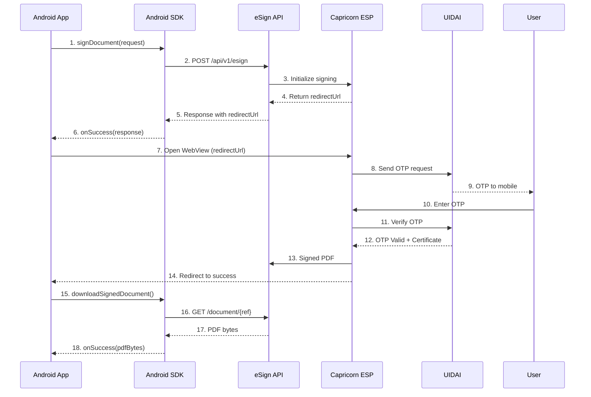

# Android SDK Complete Guide

Complete integration guide for the eSign Android SDK.

---

## Architecture Overview



!!! important "Backend Required"
    The Android SDK is an HTTP client. You must deploy the **eSign API server** 
    to handle actual PDF signing. See [eSign API Guide](esign-api-guide.md).

---

## Complete Signing Flow



---

## Installation

### Requirements

| Requirement | Version |
|-------------|---------|
| Android SDK | API 21+ (Lollipop) |
| Java | 1.8+ |
| OkHttp | 4.x |

### Step 1: Add AAR File

Copy `esign-sdk-1.0.0.aar` to your `app/libs/` folder.

### Step 2: Update build.gradle

```groovy
// app/build.gradle

android {
    // ...
}

dependencies {
    // eSign SDK
    implementation files('libs/esign-sdk-1.0.0.aar')
    
    // Required dependency
    implementation 'com.squareup.okhttp3:okhttp:4.12.0'
}
```

### Step 3: Add Permissions

```xml
<!-- AndroidManifest.xml -->
<uses-permission android:name="android.permission.INTERNET" />
<uses-permission android:name="android.permission.ACCESS_NETWORK_STATE" />
```

---

## Step-by-Step Integration

### Step 1: Initialize Client

```java
import com.capricorn.esign.ESignClient;
import com.capricorn.esign.ESignMode;
import com.capricorn.esign.ESignRequest;
import com.capricorn.esign.ESignResponse;
import com.capricorn.esign.SigningOptions;

public class MainActivity extends AppCompatActivity {
    
    private ESignClient client;
    
    @Override
    protected void onCreate(Bundle savedInstanceState) {
        super.onCreate(savedInstanceState);
        
        // Initialize client with YOUR server URL
        client = new ESignClient(
            "https://your-esign-api-server.com",  // Your eSign API server
            "your-api-token",                      // Token from Capricorn
            "your-api-key"                         // Key from Capricorn
        );
    }
}
```

### Step 2: Create Signing Request

```java
private void signDocument(String base64Pdf, String signerName) {
    
    // Create signing options
    SigningOptions options = new SigningOptions.Builder()
        .coordinates(350, 50, 550, 120)   // Signature position
        .pageNum("all")                    // Sign all pages
        .reason("Digital Signature")
        .location("India")
        .showGreenTick()
        .dateFormat("dd-MMM-yyyy hh:mm a")
        .lockPdf(SigningOptions.LockMode.NO_LOCK)
        .build();
    
    // Create request
    ESignRequest request = new ESignRequest.Builder()
        .pdf64(base64Pdf)                  // Base64 PDF (REQUIRED)
        .title("My Document")              // Title (REQUIRED)
        .mode(ESignMode.OTP)               // Auth mode (REQUIRED)
        .signerName(signerName)            // Signer name (REQUIRED)
        .txn("TXN-" + System.currentTimeMillis())
        .options(options)
        .build();
    
    executeSign(request);
}
```

### Step 3: Execute Signing & Handle Response

```java
private void executeSign(ESignRequest request) {
    
    client.signDocument(request, new ESignClient.ESignCallback() {
        
        @Override
        public void onSuccess(ESignResponse response) {
            // Get response data
            String redirectUrl = response.getRedirectUrl();  // URL for WebView
            String reference = response.getReference();      // Transaction ID
            
            Log.d("ESign", "Reference: " + reference);
            Log.d("ESign", "Redirect URL: " + redirectUrl);
            
            // Open WebView for user authentication
            openESignWebView(redirectUrl, reference);
        }
        
        @Override
        public void onError(String error) {
            Log.e("ESign", "Error: " + error);
            showError(error);
        }
    });
}
```

### Step 4: Open WebView for Authentication

```java
private static final int REQUEST_ESIGN = 1001;

private void openESignWebView(String redirectUrl, String reference) {
    Intent intent = new Intent(this, ESignWebViewActivity.class);
    intent.putExtra("redirectUrl", redirectUrl);
    intent.putExtra("reference", reference);
    startActivityForResult(intent, REQUEST_ESIGN);
}
```

### Step 5: Handle WebView Result & Download PDF

```java
@Override
protected void onActivityResult(int requestCode, int resultCode, Intent data) {
    super.onActivityResult(requestCode, resultCode, data);
    
    if (requestCode == REQUEST_ESIGN) {
        if (resultCode == RESULT_OK && data != null) {
            String reference = data.getStringExtra("reference");
            downloadSignedPdf(reference);
        } else {
            showMessage("Signing cancelled");
        }
    }
}

private void downloadSignedPdf(String reference) {
    
    client.downloadSignedDocument(reference, new ESignClient.DownloadCallback() {
        
        @Override
        public void onSuccess(byte[] pdfBytes) {
            // Save PDF to file
            File file = new File(getExternalFilesDir(null), "signed.pdf");
            FileOutputStream fos = new FileOutputStream(file);
            fos.write(pdfBytes);
            fos.close();
            
            showSuccess("PDF saved: " + file.getPath());
        }
        
        @Override
        public void onError(String error) {
            showError("Download failed: " + error);
        }
    });
}
```

---

## WebView Activity

### ESignWebViewActivity.java

```java
public class ESignWebViewActivity extends AppCompatActivity {
    
    private WebView webView;
    private String reference;

    @Override
    protected void onCreate(Bundle savedInstanceState) {
        super.onCreate(savedInstanceState);
        setContentView(R.layout.activity_esign_webview);
        
        webView = findViewById(R.id.webView);
        String redirectUrl = getIntent().getStringExtra("redirectUrl");
        reference = getIntent().getStringExtra("reference");
        
        setupWebView();
        webView.loadUrl(redirectUrl);
    }
    
    private void setupWebView() {
        WebSettings settings = webView.getSettings();
        settings.setJavaScriptEnabled(true);
        settings.setDomStorageEnabled(true);
        
        webView.setWebViewClient(new WebViewClient() {
            
            @Override
            public boolean shouldOverrideUrlLoading(WebView view, String url) {
                String urlLower = url.toLowerCase();
                
                // Detect signing completion
                if (urlLower.contains("success") || urlLower.contains("callback")) {
                    onSigningSuccess();
                    return true;
                }
                
                // Detect cancellation
                if (urlLower.contains("cancel") || urlLower.contains("error")) {
                    onSigningCancelled();
                    return true;
                }
                
                return false;
            }
        });
    }
    
    private void onSigningSuccess() {
        Intent result = new Intent();
        result.putExtra("reference", reference);
        result.putExtra("status", "SUCCESS");
        setResult(RESULT_OK, result);
        finish();
    }
    
    private void onSigningCancelled() {
        setResult(RESULT_CANCELED);
        finish();
    }
    
    @Override
    public void onBackPressed() {
        if (webView.canGoBack()) {
            webView.goBack();
        } else {
            onSigningCancelled();
        }
    }
}
```

### Layout: activity_esign_webview.xml

```xml
<?xml version="1.0" encoding="utf-8"?>
<LinearLayout 
    xmlns:android="http://schemas.android.com/apk/res/android"
    android:layout_width="match_parent"
    android:layout_height="match_parent"
    android:orientation="vertical">

    <ProgressBar
        android:id="@+id/progressBar"
        android:layout_width="match_parent"
        android:layout_height="wrap_content"
        style="@style/Widget.AppCompat.ProgressBar.Horizontal"
        android:indeterminate="true" />

    <WebView
        android:id="@+id/webView"
        android:layout_width="match_parent"
        android:layout_height="match_parent" />

</LinearLayout>
```

---

## Authentication Modes

| Mode | Enum | API Value | Description | Requirements |
|------|------|-----------|-------------|--------------|
| **OTP** | `ESignMode.OTP` | `online-aadhaar-otp` | OTP to mobile | None |
| **Biometric** | `ESignMode.BIO` | `online-aadhaar-bio` | Fingerprint | Device |
| **Iris** | `ESignMode.IRIS` | `online-aadhaar-iris` | Iris scan | Scanner |
| **Face** | `ESignMode.FACE` | `online-aadhaar-face` | Face auth | Camera |
| **eKYC** | `ESignMode.CAPRICORN_EKYC` | `capricorn-ekyc-account` | Pre-verified | ekycId |

### Usage Examples

=== "OTP Mode"
    ```java
    .mode(ESignMode.OTP)
    ```

=== "Biometric Mode"
    ```java
    .mode(ESignMode.BIO)
    ```

=== "eKYC Mode"
    ```java
    .mode(ESignMode.CAPRICORN_EKYC)
    .ekycId("EKYC123456789")  // Required!
    ```

### Helper Methods

```java
ESignMode mode = ESignMode.OTP;

mode.requiresEkycId();   // false - only CAPRICORN_EKYC needs ekycId
mode.requiresDevice();   // false - only BIO/IRIS/FACE need device
mode.getESignVersion();  // "2.1" - OTP uses eSign 2.1
```

---

## Signing Options

### All Options

```java
SigningOptions options = new SigningOptions.Builder()
    // Position (x1,y1,x2,y2) - origin bottom-left
    .coordinates(350, 50, 550, 120)
    
    // Pages: "1", "first", "last", "all", "1-3", "1,3,5"
    .pageNum("all")
    
    // Signature text
    .reason("Digital Signature")
    .location("Mumbai, India")
    .customText("Verified")
    
    // Appearance
    .greenTicked("y")                  // Show ✓ icon
    .dateFormat("dd-MMM-yyyy hh:mm a")
    
    // Protection
    .lockPdf(SigningOptions.LockMode.NO_LOCK)
    
    .build();
```

### Multi-Location Signing

For different signature positions on different pages:

```java
SigningOptions options = new SigningOptions.Builder()
    // Add positions for different pages
    .addPosition("first", "50,50,200,120")        // Bottom-left on first page
    .addPosition("2,3,4", 200, 400, 400, 470)     // Center on pages 2-4
    .addPosition("last", "400,50,550,120")        // Bottom-right on last page
    
    // Other options still apply
    .reason("Digital Signature")
    .location("India")
    .lockPdf(SigningOptions.LockMode.NO_LOCK)
    .build();
```

#### Multi-Location Methods

| Method | Description |
|--------|-------------|
| `.addPosition(pages, cood)` | Add position with coordinate string |
| `.addPosition(pages, x1, y1, x2, y2)` | Add position with coordinates |
| `.signaturePositions(List)` | Set list of SignaturePosition objects |
| `.clearPositions()` | Remove all positions |

#### SignaturePosition Class

```java
// Create positions manually if needed
List<SigningOptions.SignaturePosition> positions = new ArrayList<>();
positions.add(new SigningOptions.SignaturePosition("first", "50,50,200,120"));
positions.add(new SigningOptions.SignaturePosition("last", "400,50,550,120"));

SigningOptions options = new SigningOptions.Builder()
    .signaturePositions(positions)
    .build();
```

#### Pages Values for Multi-Location

| Value | Description |
|-------|-------------|
| `"first"` | First page only |
| `"last"` | Last page only |
| `"all"` | All pages |
| `"1"` | Specific page |
| `"1-3"` | Page range |
| `"1,3,5"` | Specific pages |

!!! note "Auto-Settings"
    When using `.addPosition()`, the SDK automatically sets `cood` and `pagenum` to `"custom"`.

### Coordinate System

```
(0, 842) ─────────────────────────────── (595, 842)
    │              TOP                        │
    │                                         │
    │   A4 Page: 595 x 842 points             │
    │                                         │
    │              Signature Box              │
    │              (x1,y1) to (x2,y2)         │
    │                                         │
    │              BOTTOM                     │
(0, 0) ───────────────────────────────── (595, 0)
```

### Common Positions

| Position | Coordinates |
|----------|-------------|
| Bottom-right | `400,50,550,120` |
| Bottom-left | `50,50,200,120` |
| Bottom-center | `200,50,400,120` |
| Top-right | `400,750,550,820` |

### Page Selection Methods

```java
.allPages()    // Sign all pages
.firstPage()   // Sign first page only
.lastPage()    // Sign last page only
.pageNum("1-3") // Pages 1 to 3
.pageNum("1,3,5") // Specific pages
```

---

## PDF Lock Modes

| Mode | Enum | Value | Description |
|------|------|-------|-------------|
| No Lock | `LockMode.NO_LOCK` | `n` | Allow modifications |
| Certified | `LockMode.CERTIFIED` | `y` | No changes allowed |
| Form Filling | `LockMode.CERTIFIED_FORM_FILLING` | `cf` | Only forms |
| Form + Annotations | `LockMode.CERTIFIED_FORM_ANNOTATIONS` | `cfa` | Forms & comments |
| Signature Lock | `LockMode.SIGNATURE_LOCK` | `ym` | Lock dictionary |

---

## Request/Response Format

### Request JSON (sent by SDK)

```json
{
  "auth": {
    "command": "esign",
    "token": "your-api-token",
    "key": "your-api-key"
  },
  "parameter": {
    "uploadpdf": {
      "pdf64": "JVBERi0xLjQK...",
      "title": "My Document",
      "mode": "online-aadhaar-otp",
      "signername": "John Doe",
      "authmode": "otp",
      "txn": "TXN-1704067200000",
      "option": {
        "cood": "350,50,550,120",
        "pagenum": "all",
        "reason": "Digital Signature",
        "location": "India",
        "greenticked": "y",
        "dateformat": "dd-MMM-yyyy hh:mm a",
        "lockpdf": "n"
      }
    }
  }
}
```

### Success Response

```json
{
  "success": "OK",
  "command": "esign",
  "requestid": "REQ-123456",
  "responsedata": {
    "response": {
      "txn": "TXN-1704067200000",
      "reference": "ESP-ABC123XYZ",
      "redirecturl": "https://esign.capricorn.com/auth?ref=ESP-ABC123XYZ",
      "getsigneddocurl": "https://api.com/document/ESP-ABC123XYZ"
    }
  }
}
```

### Error Response

```json
{
  "success": "FAIL",
  "error": {
    "code": "VAL_001",
    "message": "Missing required field: pdf64"
  }
}
```

---

## API Reference

### ESignClient

```java
// Constructors
ESignClient(String apiBaseUrl, String token, String key)
ESignClient(String apiBaseUrl, String token, String key, int timeoutSeconds)

// Methods
void signDocument(ESignRequest request, ESignCallback callback)
void getStatus(String reference, StatusCallback callback)
void downloadSignedDocument(String reference, DownloadCallback callback)
void checkHealth(HealthCallback callback)
```

### ESignRequest.Builder

```java
Builder pdf64(String base64Pdf)        // Base64 encoded PDF
Builder pdfUrl(String url)             // URL to fetch PDF
Builder title(String title)            // Document title
Builder mode(ESignMode mode)           // Authentication mode
Builder signerName(String name)        // Signer's name
Builder txn(String transactionId)      // Your transaction ID
Builder ekycId(String ekycId)          // eKYC ID (for eKYC mode)
Builder callbackUrl(String url)        // Webhook URL
Builder options(SigningOptions opts)   // Signing options
ESignRequest build()
```

### Callbacks

```java
interface ESignCallback {
    void onSuccess(ESignResponse response);
    void onError(String error);
}

interface StatusCallback {
    void onSuccess(StatusResponse status);
    void onError(String error);
}

interface DownloadCallback {
    void onSuccess(byte[] pdfBytes);
    void onError(String error);
}
```

---

## Error Handling

### Error Codes

| Code | Description | Solution |
|------|-------------|----------|
| `AUTH_001` | Invalid token | Check API credentials |
| `AUTH_002` | Invalid key | Check API key |
| `VAL_001` | Missing field | Check required fields |
| `VAL_002` | Invalid PDF | Verify Base64 encoding |
| `VAL_003` | Invalid mode | Use valid ESignMode |
| `VAL_004` | ekycId required | Add ekycId for eKYC |
| `ESP_001` | User cancelled | User cancelled signing |
| `ESP_002` | OTP failed | Invalid OTP |
| `ESP_003` | Auth failed | Aadhaar auth failed |

### Example

```java
@Override
public void onError(String error) {
    if (error.contains("AUTH_")) {
        showAlert("Invalid API credentials");
    } else if (error.contains("VAL_")) {
        showAlert("Invalid request: " + error);
    } else if (error.contains("ESP_001")) {
        showAlert("Signing cancelled");
    } else if (error.contains("Network")) {
        showAlert("Network error");
    } else {
        showAlert("Error: " + error);
    }
}
```

---

## Troubleshooting

| Problem | Solution |
|---------|----------|
| Network timeout | Increase timeout: `new ESignClient(url, token, key, 120)` |
| Large PDF fails | Use `pdfUrl()` instead of `pdf64()` |
| WebView blank | Enable JavaScript in WebView settings |
| SSL error | Check certificate or skip for testing |

---

## FAQ

!!! question "How long is the redirect URL valid?"
    Typically 15-30 minutes. After that, create a new request.

!!! question "Can I sign without WebView?"
    No. User must authenticate via Aadhaar (OTP/Bio), which requires the WebView.

!!! question "What if user closes app during signing?"
    Use the `reference` ID to check status later with `getStatus()`.

!!! question "What format is the signed PDF?"
    PKCS7_COMPLETE with TSA timestamp and LTV enabled.

---

!!! note "Signature Format"
    All signatures use **PKCS7_COMPLETE** format with **Timestamp (TSA)** 
    and **LTV (Long Term Validation)** enabled by default.
