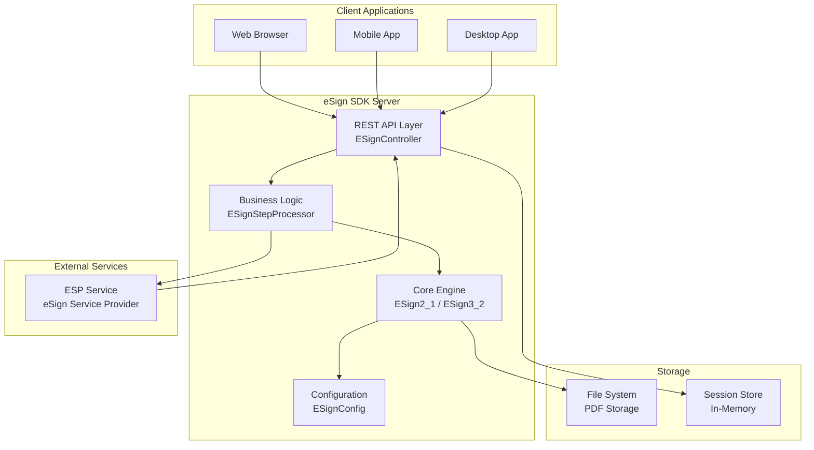
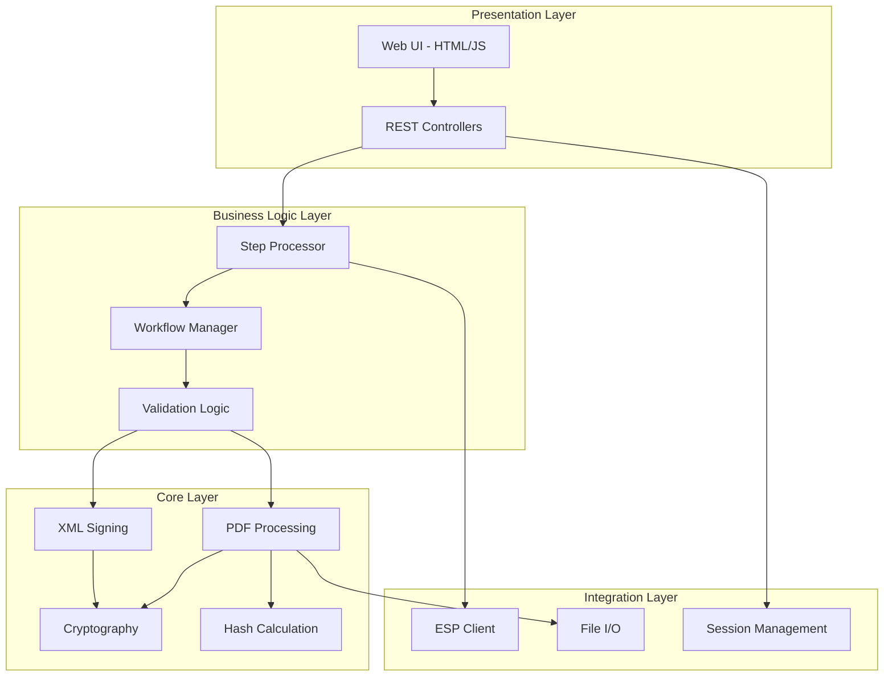
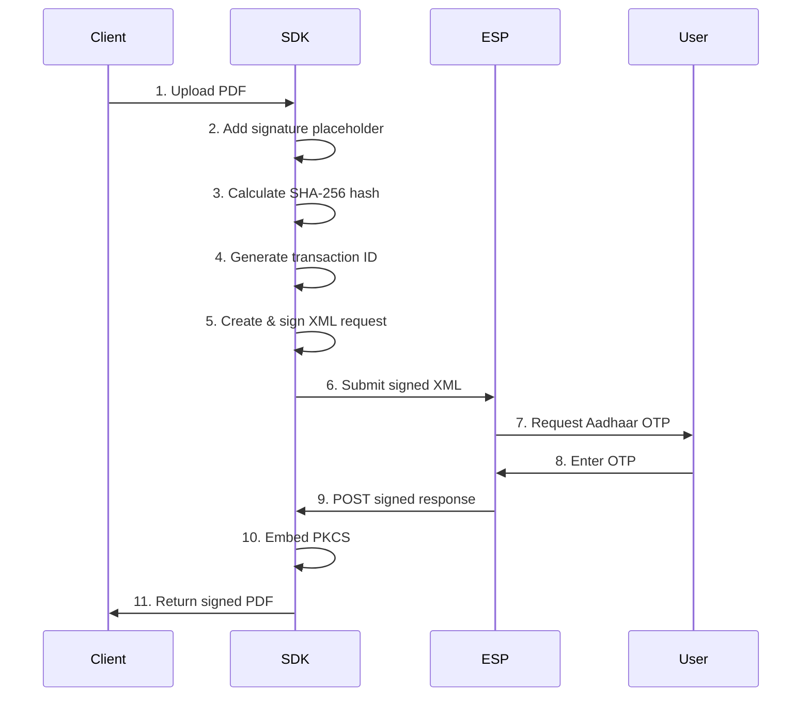
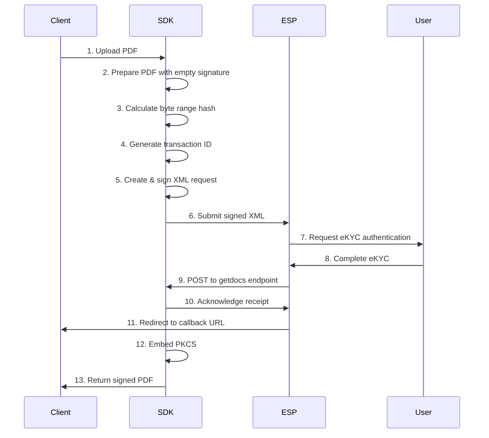
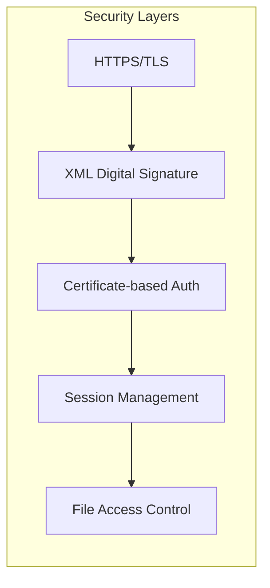

# eSign SDK v1.0.0 - Technical Documentation

**Document Version:** 1.0  
**Release Date:** December 2025  
**Author:** Capricorn Technologies  
**Product:** Digital Signature SDK for eSign API v2.1 & v3.2

---

## Table of Contents

1. [Executive Summary](#1-executive-summary)
2. [System Overview](#2-system-overview)
3. [System Architecture](#3-system-architecture)
4. [System Requirements](#4-system-requirements)
5. [Installation Guide](#5-installation-guide)
6. [Configuration Reference](#6-configuration-reference)
7. [API Documentation](#7-api-documentation)

**Sections 8-11 are in [Part 2](eSign-sdk-technical-documentation-part2.md):**
- Usage Guide
- Security & Compliance
- Troubleshooting
- Appendices

---

## 1. Executive Summary

### 1.1 Product Overview

The **eSign SDK v1.0.0** is a comprehensive Java-based server application that enables digital signature capabilities for PDF documents using India's eSign infrastructure. Built on Spring Boot 3.2.0, this SDK provides a robust, production-ready solution for integrating digital signatures into enterprise applications.

### 1.2 Key Features

- **Dual Mode Support**: eSign 2.1 (OTP-based) and eSign 3.2 (eKYC-based)
- **RESTful API**: Complete REST API for easy integration
- **PDF Processing**: Advanced PDF manipulation with signature placeholders
- **Cryptographic Security**: Industry-standard cryptography (SHA-256, RSA, PKCS#7)
- **Step-by-Step Workflow**: Granular control over signing process
- **Web Interface**: Built-in UI for testing and demonstration
- **Production Ready**: Enterprise-grade error handling and logging

### 1.3 Technical Specifications

| Specification | Details |
|---------------|---------|
| **Platform** | Java 17, Spring Boot 3.2.0 |
| **Server** | Embedded Apache Tomcat |
| **API Style** | RESTful JSON |
| **Supported Formats** | PDF (signing), XML (eSign protocol) |
| **Cryptography** | Bouncy Castle 1.64, SHA-256, RSA |
| **PDF Library** | iText 5.5.13.3 |
| **Build Tool** | Apache Maven |
| **License** | Commercial/Proprietary |

---

## 2. System Overview

### 2.1 What is eSign?

eSign is India's national digital signature service provided by the Controller of Certifying Authorities (CCA) under the Ministry of Electronics and Information Technology (MeitY). It enables citizens to digitally sign documents using Aadhaar-based authentication.

### 2.2 eSign Versions Supported

#### eSign 2.1 (OTP-based)
- **Authentication**: Aadhaar OTP
- **Use Case**: General document signing
- **Flow**: ASP → ESP → User (OTP) → ESP → ASP
- **Response**: Synchronous callback

#### eSign 3.2 (eKYC-based)
- **Authentication**: eKYC authentication
- **Use Case**: High-security document signing
- **Flow**: ASP → ESP → User (eKYC) → ESP → ASP
- **Response**: Asynchronous callback with document retrieval

### 2.3 Architecture Overview



### 2.4 Key Components

| Component | Description | Technology |
|-----------|-------------|------------|
| **ESignController** | REST API endpoints | Spring MVC |
| **ESignStepProcessor** | Step-by-step workflow orchestration | Java |
| **ESign2_1** | Core eSign 2.1 implementation | Java, iText, Bouncy Castle |
| **ESign3_2** | Core eSign 3.2 implementation | Java, iText, Bouncy Castle |
| **ESignConfig** | Configuration management | Java Properties |
| **ESignUtility** | Helper utilities | Java |

---

## 3. System Architecture

### 3.1 Layered Architecture



### 3.2 Data Flow

#### eSign 2.1 Flow


#### eSign 3.2 Flow


### 3.3 Security Architecture



**Security Features:**
- XML requests signed with ASP certificate (X.509)
- SHA-256 hash algorithm for document integrity
- PKCS#7 signature format (industry standard)
- Session-based state management
- Secure file storage with unique identifiers
- Certificate validation (Bouncy Castle)

---

## 4. System Requirements

### 4.1 Server Requirements

#### Minimum Requirements
| Component | Specification |
|-----------|---------------|
| **CPU** | 2 cores, 2.0 GHz |
| **RAM** | 4 GB |
| **Storage** | 10 GB free space |
| **Network** | 10 Mbps internet connection |

#### Recommended Requirements
| Component | Specification |
|-----------|---------------|
| **CPU** | 4 cores, 2.5 GHz or higher |
| **RAM** | 8 GB or more |
| **Storage** | 50 GB SSD |
| **Network** | 100 Mbps internet connection |

### 4.2 Software Requirements

#### Required Software
| Software | Version | Purpose |
|----------|---------|---------|
| **Java JDK** | 17 or higher | Runtime environment |
| **Maven** | 3.6+ | Build tool (for compilation) |

#### Operating System Support

| OS | Versions | Status |
|----|----------|--------|
| **Windows** | Windows Server 2016/2019/2022, Windows 10/11 | Fully Supported |
| **Linux** | Ubuntu 20.04+, CentOS 7+, RHEL 7+, Debian 10+ | Fully Supported |
| **macOS** | macOS 11+ | Fully Supported |
| **Unix** | Solaris, AIX | Not tested, should work |

> [!NOTE]
> The application is platform-independent as it runs on the Java Virtual Machine (JVM). Any OS that supports Java 17+ can run this SDK.

### 4.3 Network Requirements

| Requirement | Details |
|-------------|---------|
| **Inbound Ports** | 8080 (HTTP) - configurable |
| **Outbound Ports** | 443 (HTTPS) for ESP communication |
| **Firewall** | Allow connections to ESP URLs |
| **Public Access** | Required for ESP callbacks (or use ngrok/tunneling) |

### 4.4 External Dependencies

| Service | Purpose | URL |
|---------|---------|-----|
| **ESP Service** | eSign Service Provider | `https://demo.esign.digital/` (demo)<br/>`https://esp.esign.digital/` (production) |
| **CCA** | Certificate validation | Automatic via Bouncy Castle |

---

## 5. Installation Guide

### 5.1 Pre-Installation Checklist

- [ ] Java 17 JDK installed
- [ ] Maven 3.6+ installed (if building from source)
- [ ] eSign license file obtained
- [ ] ASP certificate (.pfx file) obtained
- [ ] Network connectivity to ESP service
- [ ] Firewall configured for port 8080

### 5.2 Installation Methods

#### Method 1: Using Pre-built JAR (Recommended)

**Step 1: Download the SDK**
```bash
# Extract the distribution package
unzip esign-sdk-1.0-dist.zip
cd esign-sdk-1.0
```

**Step 2: Verify Java Installation**
```bash
java -version
# Should show: openjdk version "17.x.x" or higher
```

**Step 3: Configure the Application**
```bash
# Edit application.properties
nano application.properties
# Or on Windows:
notepad application.properties
```

**Step 4: Place Required Files**
```
esign-sdk-1.0/
├── esign-sdk-1.0.jar
├── application.properties
├── config/
│   ├── eSignLicense          # Your eSign license file
│   ├── privatekey.pfx         # Your ASP certificate
│   └── sample.pdf             # (Optional) Test PDF
├── temp/                      # Auto-created for temporary files
└── signed/                    # Auto-created for signed PDFs
```

**Step 5: Run the Application**

**On Windows:**
```powershell
java -jar esign-sdk-1.0.jar
```

**On Linux/macOS:**
```bash
java -jar esign-sdk-1.0.jar
```

**Step 6: Verify Installation**
```bash
# Open browser and navigate to:
http://localhost:8080
```

You should see the eSign SDK web interface.

---

#### Method 2: Building from Source

**Step 1: Clone/Extract Source Code**
```bash
cd /path/to/source
```

**Step 2: Build with Maven**
```bash
mvn clean package
```

This creates: `target/esign-sdk-1.0.jar`

**Step 3: Run the Application**
```bash
cd target
java -jar esign-sdk-1.0.jar
```

---

### 5.3 Installation on Different Operating Systems

#### 5.3.1 Windows Server Installation

**Step 1: Install Java 17**
```powershell
# Download from https://adoptium.net/
# Or use Chocolatey:
choco install openjdk17
```

**Step 2: Create Installation Directory**
```powershell
mkdir C:\esign-sdk
cd C:\esign-sdk
```

**Step 3: Copy Files**
```powershell
# Copy esign-sdk-1.0.jar and application.properties
# Create config folder
mkdir config
# Copy license and certificate to config\
```

**Step 4: Run as Windows Service (Optional)**

Create `install-service.bat`:
```batch
@echo off
sc create "eSignSDK" binPath= "C:\esign-sdk\run-service.bat" start= auto
sc description "eSignSDK" "eSign Digital Signature Service"
sc start "eSignSDK"
```

Create `run-service.bat`:
```batch
@echo off
cd C:\esign-sdk
java -jar esign-sdk-1.0.jar
```

**Step 5: Configure Firewall**
```powershell
netsh advfirewall firewall add rule name="eSign SDK" dir=in action=allow protocol=TCP localport=8080
```

---

#### 5.3.2 Linux (Ubuntu/Debian) Installation

**Step 1: Install Java 17**
```bash
sudo apt update
sudo apt install openjdk-17-jdk -y
```

**Step 2: Create Installation Directory**
```bash
sudo mkdir -p /opt/esign-sdk
cd /opt/esign-sdk
```

**Step 3: Copy Files**
```bash
# Copy JAR and properties file
sudo cp esign-sdk-1.0.jar /opt/esign-sdk/
sudo cp application.properties /opt/esign-sdk/

# Create directories
sudo mkdir -p /opt/esign-sdk/config
sudo mkdir -p /opt/esign-sdk/temp
sudo mkdir -p /opt/esign-sdk/signed

# Copy license and certificate
sudo cp eSignLicense /opt/esign-sdk/config/
sudo cp privatekey.pfx /opt/esign-sdk/config/
```

**Step 4: Create Systemd Service**

Create `/etc/systemd/system/esign-sdk.service`:
```ini
[Unit]
Description=eSign SDK Service
After=network.target

[Service]
Type=simple
User=esign
WorkingDirectory=/opt/esign-sdk
ExecStart=/usr/bin/java -jar /opt/esign-sdk/esign-sdk-1.0.jar
Restart=on-failure
RestartSec=10

[Install]
WantedBy=multi-user.target
```

**Step 5: Create Service User**
```bash
sudo useradd -r -s /bin/false esign
sudo chown -R esign:esign /opt/esign-sdk
```

**Step 6: Enable and Start Service**
```bash
sudo systemctl daemon-reload
sudo systemctl enable esign-sdk
sudo systemctl start esign-sdk
sudo systemctl status esign-sdk
```

**Step 7: Configure Firewall (UFW)**
```bash
sudo ufw allow 8080/tcp
sudo ufw reload
```

---

#### 5.3.3 Linux (CentOS/RHEL) Installation

**Step 1: Install Java 17**
```bash
sudo yum install java-17-openjdk java-17-openjdk-devel -y
```

**Step 2-6: Same as Ubuntu** (use `/opt/esign-sdk`)

**Step 7: Configure Firewall (firewalld)**
```bash
sudo firewall-cmd --permanent --add-port=8080/tcp
sudo firewall-cmd --reload
```

---

#### 5.3.4 Docker Installation (All Platforms)

**Step 1: Create Dockerfile**
```dockerfile
FROM openjdk:17-jdk-slim

WORKDIR /app

# Copy application files
COPY esign-sdk-1.0.jar /app/
COPY application.properties /app/
COPY config/ /app/config/

# Create directories
RUN mkdir -p /app/temp /app/signed

# Expose port
EXPOSE 8080

# Run application
CMD ["java", "-jar", "esign-sdk-1.0.jar"]
```

**Step 2: Build Docker Image**
```bash
docker build -t esign-sdk:1.0 .
```

**Step 3: Run Container**
```bash
docker run -d \
  --name esign-sdk \
  -p 8080:8080 \
  -v $(pwd)/config:/app/config \
  -v $(pwd)/temp:/app/temp \
  -v $(pwd)/signed:/app/signed \
  esign-sdk:1.0
```

**Step 4: View Logs**
```bash
docker logs -f esign-sdk
```

---

### 5.4 Post-Installation Verification

**Step 1: Check Application Logs**
```
========================================
  eSign SDK Started Successfully!
========================================
  Open: http://localhost:8080
========================================
```

**Step 2: Test API Endpoint**
```bash
curl http://localhost:8080/api/esign/set-mode \
  -H "Content-Type: application/json" \
  -d '{"mode":"2.1"}'
```

Expected response:
```json
{
  "success": true,
  "mode": "2.1",
  "modeName": "OTP-based Signing",
  "message": "eSign mode set to 2.1"
}
```

**Step 3: Access Web Interface**
Open browser: `http://localhost:8080`

---

### 5.5 Troubleshooting Installation

| Issue | Solution |
|-------|----------|
| **Port 8080 already in use** | Change port in `application.properties`: `server.port=8081` |
| **Java version error** | Ensure Java 17+ is installed: `java -version` |
| **License file not found** | Check path in `application.properties`: `esign.license.path` |
| **Certificate error** | Verify `.pfx` file path and password in properties |
| **Permission denied (Linux)** | Run with sudo or fix ownership: `sudo chown -R esign:esign /opt/esign-sdk` |

---

## 6. Configuration Reference

### 6.1 Configuration File Location

The application reads configuration from `application.properties` located in:
1. **Classpath** (inside JAR): `src/main/resources/application.properties`
2. **Working directory**: `./application.properties` (overrides classpath)
3. **Custom location**: Specify with `--spring.config.location`

### 6.2 Complete Configuration Reference

```properties
# ========================================
# Server Configuration
# ========================================
server.port=8080
# Port on which the application runs
# Default: 8080
# Change if port is already in use

# ========================================
# eSign 2.1 (OTP-based) Configuration
# ========================================
esign.2_1.esp.url=https://demo.esign.digital/esign/2.1/signdoc/
# ESP endpoint for eSign 2.1
# Demo: https://demo.esign.digital/esign/2.1/signdoc/
# Production: https://esp.esign.digital/esign/2.1/signdoc/

esign.2_1.response.url=https://your-domain.com/api/esign/esp-response
# Callback URL where ESP sends signed response
# MUST be publicly accessible
# Use ngrok for local testing: https://xxx.ngrok-free.dev/api/esign/esp-response

# ========================================
# eSign 3.2 (eKYC-based) Configuration
# ========================================
esign.3_2.esp.url=https://demo.esign.digital/esign/3.2/signdoc/
# ESP endpoint for eSign 3.2
# Demo: https://demo.esign.digital/esign/3.2/signdoc/
# Production: https://esp.esign.digital/esign/3.2/signdoc/

esign.3_2.response.url=https://your-domain.com/api/esign/3.2/getdocs/
# Callback URL where ESP POSTs signed documents
# MUST be publicly accessible

esign.3_2.redirect.url=https://your-domain.com/api/esign/3.2/callback/
# Redirect URL where user is sent after signing
# MUST be publicly accessible

esign.3_2.signer.id=your-signer-id@username.YourASP
# Signer identifier for eSign 3.2
# Format: username@identifier.ASPName
# Obtain from your ESP provider

# ========================================
# Common Configuration
# ========================================
esign.asp.id=your-asp-id
# Application Service Provider ID
# Obtain from your eSign license

esign.ekyc.id=
# eKYC ID (optional, for eSign 3.2)
# Leave empty if not using eKYC mode

esign.license.path=./config/eSignLicense
# Path to eSign license file
# Relative or absolute path

esign.certificate.path=./config/privatekey.pfx
# Path to ASP certificate (.pfx file)
# Used for signing XML requests

esign.certificate.password=your-password
# Password for the .pfx certificate file

esign.temp.path=./temp/
# Directory for temporary files
# Auto-created if doesn't exist

esign.output.path=./signed/
# Directory for signed PDF output
# Auto-created if doesn't exist

esign.base.url=http://localhost:8080
# Base URL of this application
# Used for generating document URLs in eSign 3.2
# Change to your public domain in production

# ========================================
# File Upload Configuration
# ========================================
spring.servlet.multipart.max-file-size=50MB
# Maximum size for uploaded PDF files

spring.servlet.multipart.max-request-size=50MB
# Maximum size for HTTP requests
```

### 6.3 Environment-Specific Configuration

#### Development Environment
```properties
server.port=8080
esign.2_1.esp.url=https://demo.esign.digital/esign/2.1/signdoc/
esign.2_1.response.url=https://xxx.ngrok-free.dev/api/esign/esp-response
esign.base.url=http://localhost:8080
```

#### Production Environment
```properties
server.port=80
esign.2_1.esp.url=https://esp.esign.digital/esign/2.1/signdoc/
esign.2_1.response.url=https://your-production-domain.com/api/esign/esp-response
esign.base.url=https://your-production-domain.com
```

### 6.4 Configuration Validation

The application validates configuration on startup:
- License file exists and is readable
- Certificate file exists and password is correct
- Temp and output directories are writable
- ESP URLs are valid

---

## 7. API Documentation

### 7.1 API Overview

**Base URL:** `http://localhost:8080/api/esign`  
**Content-Type:** `application/json`  
**Authentication:** Session-based (cookies)

### 7.2 API Endpoints Summary

| Endpoint | Method | Purpose |
|----------|--------|---------|
| `/set-mode` | POST | Set eSign mode (2.1 or 3.2) |
| `/documents/{id}.pdf` | GET | Serve PDF documents |
| `/step1/upload` | POST | Upload PDF for signing |
| `/step2/signer-details` | POST | Set signer information |
| `/step3/generate-hash` | POST | Generate document hash |
| `/step4/convert-hex` | POST | Convert hash to hex |
| `/step5/generate-txn` | POST | Generate transaction ID |
| `/step6/construct-xml` | POST | Construct XML request |
| `/step7/sign-xml` | POST | Sign XML with certificate |
| `/step8/generate-esp-form` | POST | Generate ESP redirect form |
| `/esp-response` | POST | ESP callback (eSign 2.1) |
| `/3.2/getdocs/` | POST | ESP callback (eSign 3.2) |
| `/3.2/callback/` | GET/POST | User redirect (eSign 3.2) |
| `/esp-response-data` | GET | Get ESP response data |
| `/embed-signature` | POST | Embed signature into PDF |
| `/step9/embed-signature` | POST | Step 9: Embed signature |
| `/config` | GET | Get configuration |
| `/reset` | POST | Reset session |

