# eSign SDK - Complete Installation Guide

Complete setup guide with step-by-step instructions for Windows, Linux, and Mac.

---

## ⏱️ Quick Overview

```mermaid
flowchart LR
    A[1. Extract Package] --> B[2. Setup Public URL]
    B --> C[3. Configure]
    C --> D[4. Start Server]
    D --> E[✅ Ready!]
```



| Step | Time | Description |
|------|------|-------------|
| 1. Extract | 1 min | Unzip the package |
| 2. Setup Public URL | 5 min | ngrok (quick) OR own domain (if available) |
| 3. Configure | 3 min | Edit application.properties |
| 4. Start | 1 min | Run start script |
| **Total** | **~10 min** | |

!!! success "No Build Required!"
    JAR files are pre-built. Just extract, configure, and start!

---

## Prerequisites

### Required Software

| Software | Version | Purpose |
|----------|---------|---------|
| **Java JDK** | 17+ | Runtime |
| **ngrok** | Any | HTTPS tunnel for ESP callbacks (Option A) |

!!! note "Alternative to ngrok"
    If you have a server with a **public IP** and **domain name**, you can use that instead of ngrok. See [Option B: Use Your Own Domain](#option-b-use-your-own-domain-alternative) for details.

!!! note "Maven Not Required"
    Maven is only needed if you want to modify Java source code. For normal usage, JAR files are pre-built.

---

## What You Get from Capricorn (ESP Provider)

Before starting installation, ensure you have received the following from **Capricorn Technologies** (your ESP provider):

### Files

| File | Description | Where to Place |
|------|-------------|----------------|
| `eSignLicense` | License file to activate SDK | `esign-api/config/` |
| `privatekey.pfx` | Digital certificate for signing | `esign-api/config/` |

### Credentials

| Credential | Description | Example |
|------------|-------------|---------|
| **ASP ID** | Your organization's unique identifier | `yourcompanyaspid` |
| **Signer ID** | eKYC signer identifier (for eSign 3.2 mode) | `user@yourcompany.capricorn` |
| **Certificate Password** | Password for privatekey.pfx | `your_password` |
| **ESP URL (2.1)** | OTP signing endpoint | `https://esign.cdac.in/esign/2.1/signdoc/` |
| **ESP URL (3.2)** | eKYC signing endpoint | `https://esign.cdac.in/esign/3.2/signdoc/` |

### Demo vs Production URLs

| Environment | Purpose | URL Type |
|-------------|---------|----------|
| **Demo/Sandbox** | Testing and development | `https://demo.esign...` |
| **Production** | Live document signing | `https://esign...` |

!!! warning "Don't Have These Yet?"
    Contact Capricorn Technologies to:
    
    1. Complete registration process
    2. Sign agreement and pay fees
    3. Receive credentials via secure channel

---

## What You Configure Yourself

These are **NOT** from Capricorn - you create them:

| Setting | Description | Example |
|---------|-------------|---------|
| `api.auth.token` | Any secure string for API authentication | `MySecureToken123!@#` |
| `api.auth.key` | Any secure string for API authentication | `MySecureKey456$%^` |
| `api.base-url` | Your ngrok URL (or production domain) | `https://abc123.ngrok-free.dev` |

!!! tip "Security Tip"
    Use strong, random strings for `token` and `key`. These authenticate your JavaScript/Android SDK clients.

---

## Step 1: Install Java

=== "Windows"

    **Option A: Automatic (Recommended)**
    ```cmd
    install-prerequisites.bat
    ```
    Run as Administrator. This installs Java, Maven, and ngrok via Chocolatey.

    **Option B: Manual with Chocolatey**
    ```cmd
    choco install temurin17 -y
    ```

    **Option C: Manual Download**
    
    1. Download from [Adoptium](https://adoptium.net/)
    2. Run installer
    3. Add to PATH

=== "Linux"

    **Ubuntu/Debian:**
    ```bash
    sudo apt update
    sudo apt install -y openjdk-17-jdk
    ```

    **CentOS/RHEL:**
    ```bash
    sudo yum install -y java-17-openjdk-devel
    ```

    **Fedora:**
    ```bash
    sudo dnf install -y java-17-openjdk-devel
    ```

=== "Mac"

    **Option A: Homebrew (Recommended)**
    ```bash
    brew install openjdk@17
    echo 'export PATH="/opt/homebrew/opt/openjdk@17/bin:$PATH"' >> ~/.zshrc
    source ~/.zshrc
    ```

    **Option B: Manual Download**
    
    1. Download from [Adoptium](https://adoptium.net/)
    2. Run installer

### Verify Java Installation

=== "Windows"

    ```cmd
    java -version
    ```

=== "Linux"

    ```bash
    java -version
    ```

=== "Mac"

    ```bash
    java -version
    ```

Expected output: `openjdk version "17.x.x"` or higher.

---

## Step 2: Setup Public URL (Required)

!!! info "Why a Public URL is Required"
    The ESP (eSign Provider) needs to send the signed document back to your server. Since your local server (`localhost:8081`) is not accessible from the internet, you need a **public URL** that can route traffic to your server.

    ```
    Internet                         Your Server
    ┌─────────────────┐              ┌─────────────────┐
    │  ESP Server     │              │  localhost:8081 │
    │                 │   Public     │                 │
    │  Sends signed   │──────────────│  Receives       │
    │  document to    │   URL        │  callback       │
    │  your URL       │              │                 │
    └─────────────────┘              └─────────────────┘
    ```

### Choose Your Option

You have **two options** for getting a public URL:

| Option | Best For | Requirements |
|--------|----------|--------------|
| **Option A: ngrok** | Development, Testing, Quick setup | Free ngrok account |
| **Option B: Own Domain** | Development with existing server, Production | Domain, SSL certificate, Server with public IP |

---

### Option A: Use ngrok (Recommended for Development)

ngrok creates a secure tunnel from the internet to your local machine. Great for development and testing.

#### A.1 Create ngrok Account (Free)

1. Go to [https://ngrok.com/](https://ngrok.com/)
2. Click **"Sign up"** (top right)
3. Create account (email or GitHub/Google)
4. Verify your email

#### A.2 Get Your Authtoken

1. Login to [ngrok Dashboard](https://dashboard.ngrok.com/)
2. Go to **"Your Authtoken"** in left sidebar
3. Click **"Copy"** to copy your authtoken

!!! info "Authtoken looks like this"
    ```
    2abc123XYZ456789abcdefghijklmnop_qrstuvwxyz
    ```

#### A.3 Install ngrok

=== "Windows"

    **Option A: Chocolatey**
    ```cmd
    choco install ngrok -y
    ```

    **Option B: Manual Download**
    
    1. Download from [ngrok.com/download](https://ngrok.com/download)
    2. Extract `ngrok.exe` to a folder
    3. Add folder to PATH

=== "Linux"

    **Ubuntu/Debian:**
    ```bash
    curl -s https://ngrok-agent.s3.amazonaws.com/ngrok.asc | sudo tee /etc/apt/trusted.gpg.d/ngrok.asc >/dev/null
    echo "deb https://ngrok-agent.s3.amazonaws.com buster main" | sudo tee /etc/apt/sources.list.d/ngrok.list
    sudo apt update
    sudo apt install ngrok
    ```

    **Using Snap:**
    ```bash
    sudo snap install ngrok
    ```

=== "Mac"

    **Homebrew:**
    ```bash
    brew install ngrok
    ```

#### A.4 Configure ngrok with Authtoken

=== "Windows"

    ```cmd
    ngrok config add-authtoken YOUR_AUTHTOKEN_HERE
    ```

=== "Linux"

    ```bash
    ngrok config add-authtoken YOUR_AUTHTOKEN_HERE
    ```

=== "Mac"

    ```bash
    ngrok config add-authtoken YOUR_AUTHTOKEN_HERE
    ```

!!! success "Expected Output"
    ```
    Authtoken saved to configuration file: /path/to/ngrok.yml
    ```

#### A.5 Test ngrok

=== "Windows"

    ```cmd
    ngrok version
    ```

=== "Linux"

    ```bash
    ngrok version
    ```

=== "Mac"

    ```bash
    ngrok version
    ```

---

### Option B: Use Your Own Domain (Alternative)

If you have a server with a **public IP address** and a **domain name**, you can use that instead of ngrok. This is useful if:

- You already have a development server with public access
- Your organization doesn't allow ngrok
- You want a stable URL that doesn't change

#### B.1 Requirements

| Requirement | Description |
|-------------|-------------|
| **Server with Public IP** | Your server must be accessible from the internet |
| **Domain Name** | e.g., `esign-dev.yourcompany.com` |
| **SSL Certificate** | HTTPS is required (use Let's Encrypt for free) |
| **Port 8081 Open** | Firewall must allow incoming traffic on port 8081 |

#### B.2 Setup Steps

**1. Configure DNS**

Point your domain to your server's public IP:
```
esign-dev.yourcompany.com  →  YOUR_SERVER_PUBLIC_IP
```

**2. Install SSL Certificate (Let's Encrypt)**

```bash
# Install Certbot
sudo apt install certbot

# Get certificate
sudo certbot certonly --standalone -d esign-dev.yourcompany.com

# Certificate files will be at:
# /etc/letsencrypt/live/esign-dev.yourcompany.com/fullchain.pem
# /etc/letsencrypt/live/esign-dev.yourcompany.com/privkey.pem
```

**3. Configure Nginx Reverse Proxy (Recommended)**

```bash
sudo nano /etc/nginx/sites-available/esign-api
```

```nginx
server {
    listen 80;
    server_name esign-dev.yourcompany.com;
    return 301 https://$server_name$request_uri;
}

server {
    listen 443 ssl http2;
    server_name esign-dev.yourcompany.com;

    ssl_certificate /etc/letsencrypt/live/esign-dev.yourcompany.com/fullchain.pem;
    ssl_certificate_key /etc/letsencrypt/live/esign-dev.yourcompany.com/privkey.pem;
    ssl_protocols TLSv1.2 TLSv1.3;

    location / {
        proxy_pass http://localhost:8081;
        proxy_set_header Host $host;
        proxy_set_header X-Real-IP $remote_addr;
        proxy_set_header X-Forwarded-For $proxy_add_x_forwarded_for;
        proxy_set_header X-Forwarded-Proto $scheme;
    }
}
```

```bash
sudo ln -s /etc/nginx/sites-available/esign-api /etc/nginx/sites-enabled/
sudo nginx -t
sudo systemctl reload nginx
```

**4. Open Firewall**

```bash
sudo ufw allow 80/tcp
sudo ufw allow 443/tcp
sudo ufw reload
```

**5. Update application.properties**

```properties
# Use your domain instead of ngrok URL
api.base-url=https://esign-dev.yourcompany.com
```

#### B.3 Verify Setup

```bash
# Test from any machine on the internet
curl https://esign-dev.yourcompany.com/api/v1/esign/health
```

Expected response: `{"status":"UP"}`

!!! tip "Development vs Production"
    You can use the same domain setup for both development and production. The only difference is typically:
    
    - **Development:** Demo ESP URLs from Capricorn
    - **Production:** Production ESP URLs from Capricorn

---

## Step 3: Extract Package

=== "Windows"

    ```cmd
    :: Right-click esign-sdk-complete.zip → Extract All
    :: Or use command line:
    tar -xf esign-sdk-complete.zip
    cd esign-sdk-complete
    ```

=== "Linux"

    ```bash
    unzip esign-sdk-complete.zip
    cd esign-sdk-complete
    chmod +x *.sh
    ```

=== "Mac"

    ```bash
    unzip esign-sdk-complete.zip
    cd esign-sdk-complete
    chmod +x *.sh
    ```

### Package Structure

```
esign-sdk-complete/
├── esign-api/
│   ├── target/
│   │   └── esign-api-1.0.0.jar        ← Pre-built JAR (~50 MB)
│   ├── application.properties          ← Edit this (main config)
│   └── config/
│       ├── eSignLicense                ← Replace with yours
│       └── privatekey.pfx              ← Replace with yours
│
├── tomcat_esign/
│   ├── target/
│   │   └── br-esign-sdk-1.0.0-exec.jar ← Pre-built JAR (~40 MB)
│   ├── application.properties          ← Edit this (Web UI config)
│   └── config/
│       ├── eSignLicense                ← Replace with yours
│       └── privatekey.pfx              ← Replace with yours
│
├── start.bat / start.sh                ← Start REST API
├── start-ui.bat / start-ui.sh          ← Start Web UI (optional)
└── ...
```

---

## Step 4: Replace License Files

Get these files from **Capricorn Technologies** (your ESP provider):

- `eSignLicense` - License file
- `privatekey.pfx` - Digital certificate

=== "Windows"

    ```cmd
    :: Replace in esign-api
    copy "C:\path\to\your\eSignLicense" "esign-api\config\"
    copy "C:\path\to\your\privatekey.pfx" "esign-api\config\"
    
    :: Replace in tomcat_esign (if using Web UI)
    copy "C:\path\to\your\eSignLicense" "tomcat_esign\config\"
    copy "C:\path\to\your\privatekey.pfx" "tomcat_esign\config\"
    ```

=== "Linux"

    ```bash
    # Replace in esign-api
    cp /path/to/your/eSignLicense esign-api/config/
    cp /path/to/your/privatekey.pfx esign-api/config/
    
    # Replace in tomcat_esign (if using Web UI)
    cp /path/to/your/eSignLicense tomcat_esign/config/
    cp /path/to/your/privatekey.pfx tomcat_esign/config/
    ```

=== "Mac"

    ```bash
    # Replace in esign-api
    cp /path/to/your/eSignLicense esign-api/config/
    cp /path/to/your/privatekey.pfx esign-api/config/
    
    # Replace in tomcat_esign (if using Web UI)
    cp /path/to/your/eSignLicense tomcat_esign/config/
    cp /path/to/your/privatekey.pfx tomcat_esign/config/
    ```

---

## Step 5: Start ngrok Tunnel

Open a **new terminal** and start ngrok:

=== "Windows"

    ```cmd
    ngrok http 8081
    ```

=== "Linux"

    ```bash
    ngrok http 8081
    ```

=== "Mac"

    ```bash
    ngrok http 8081
    ```

### Copy Your ngrok URL

You'll see output like this:

```
Session Status                online
Account                       your@email.com (Plan: Free)
Version                       3.x.x
Region                        India (in)
Web Interface                 http://127.0.0.1:4040
Forwarding                    https://a1b2c3d4.ngrok-free.dev -> http://localhost:8081
```

!!! success "Copy the Forwarding URL"
    Copy `https://a1b2c3d4.ngrok-free.dev` (your URL will be different)

!!! warning "Keep ngrok Running"
    Keep this terminal open! If you close it, the tunnel stops and ESP callbacks will fail.

---

## Step 6: Configure Application

Edit the configuration file:

=== "Windows"

    ```cmd
    notepad esign-api\application.properties
    ```

=== "Linux"

    ```bash
    nano esign-api/application.properties
    ```

=== "Mac"

    ```bash
    open -e esign-api/application.properties
    :: Or use nano:
    nano esign-api/application.properties
    ```

### Configuration Settings

```properties
# ========================================
# YOUR NGROK URL (from Step 5)
# ========================================
api.base-url=https://YOUR-NGROK-URL.ngrok-free.dev

# ========================================
# API AUTHENTICATION (You create these - any secure strings)
# ========================================
api.auth.token=YOUR_SECURE_TOKEN
api.auth.key=YOUR_SECURE_KEY

# ========================================
# CREDENTIALS FROM CAPRICORN
# ========================================
esign.asp.id=YOUR_ASP_ID
esign.certificate.password=YOUR_CERTIFICATE_PASSWORD
esign.3_2.signer.id=youruser@yourcompany.capricorn

# ========================================
# ESP URLs (From Capricorn - usually don't change)
# ========================================
esign.2_1.esp.url=https://demo.esign.digital/esign/2.1/signdoc/
esign.3_2.esp.url=https://demo.esign.digital/esign/3.2/signdoc/
```

### What Each Setting Means

| Setting | Source | Example |
|---------|--------|---------|
| `api.base-url` | Your ngrok URL | `https://a1b2c3d4.ngrok-free.dev` |
| `api.auth.token` | You create (any string) | `MySecureToken123` |
| `api.auth.key` | You create (any string) | `MySecureKey456` |
| `esign.asp.id` | From Capricorn | `yourcompanyaspid` |
| `esign.certificate.password` | From Capricorn | `your_password` |
| `esign.3_2.signer.id` | From Capricorn | `user@company.capricorn` |

---

## Step 7: Start the Server

=== "Windows"

    ```cmd
    start.bat
    ```

=== "Linux"

    ```bash
    ./start.sh
    ```

=== "Mac"

    ```bash
    ./start.sh
    ```

### Expected Output

```
========================================
  Starting eSign REST API Server
========================================

Server: esign-api (REST API)
Port:   8081

Config: esign-api/application.properties
        (Edit this file, then restart - NO rebuild needed)

Endpoints:
  Health Check: http://localhost:8081/api/v1/esign/health
  Upload PDF:   http://localhost:8081/api/v1/esign/upload-pdf

Press Ctrl+C to stop the server.
----------------------------------------

  .   ____          _            __ _ _
 /\\ / ___'_ __ _ _(_)_ __  __ _ \ \ \ \
...
Started ESignApiApplication in 3.5 seconds
```

---

## Step 8: Verify Installation

### Test Health Endpoint

=== "Windows"

    ```cmd
    curl http://localhost:8081/api/v1/esign/health
    ```
    
    Or open in browser: `http://localhost:8081/api/v1/esign/health`

=== "Linux"

    ```bash
    curl http://localhost:8081/api/v1/esign/health
    ```

=== "Mac"

    ```bash
    curl http://localhost:8081/api/v1/esign/health
    ```

### Expected Response

```json
{"status":"UP"}
```

### Test via ngrok URL

=== "Windows"

    ```cmd
    curl https://YOUR-NGROK-URL.ngrok-free.dev/api/v1/esign/health
    ```

=== "Linux"

    ```bash
    curl https://YOUR-NGROK-URL.ngrok-free.dev/api/v1/esign/health
    ```

=== "Mac"

    ```bash
    curl https://YOUR-NGROK-URL.ngrok-free.dev/api/v1/esign/health
    ```

!!! success "Installation Complete! ✅"
    Your eSign SDK server is now running and accessible via ngrok.

---

## Configuration Changes (No Rebuild Needed!)

!!! tip "External Config Files"
    Configuration files are **external** to the JAR. Just edit and restart - no rebuild required!

### When ngrok URL Changes

1. Copy new ngrok URL
2. Edit `esign-api/application.properties`
3. Restart server

=== "Windows"

    ```cmd
    :: Stop server (Ctrl+C), then:
    notepad esign-api\application.properties
    :: Update api.base-url, save, then:
    start.bat
    ```

=== "Linux"

    ```bash
    # Stop server (Ctrl+C), then:
    nano esign-api/application.properties
    # Update api.base-url, save, then:
    ./start.sh
    ```

=== "Mac"

    ```bash
    # Stop server (Ctrl+C), then:
    nano esign-api/application.properties
    # Update api.base-url, save, then:
    ./start.sh
    ```

### What Requires Restart vs Rebuild

| Change | Action |
|--------|--------|
| `application.properties` | Just restart |
| ngrok URL | Just restart |
| License files | Just restart |
| Java code (.java files) | Rebuild required |

---

## Optional: Web UI for Testing

If you want to test eSign via browser (without JavaScript/Android SDK):

=== "Windows"

    ```cmd
    start-ui.bat
    ```

=== "Linux"

    ```bash
    ./start-ui.sh
    ```

=== "Mac"

    ```bash
    ./start-ui.sh
    ```

Open browser: `http://localhost:8080`

!!! note "Web UI Config"
    If using Web UI, also edit `tomcat_esign/application.properties` with your ngrok URL.

---

## Stop Services

=== "Windows"

    ```cmd
    :: Press Ctrl+C in terminal
    :: Or force kill:
    taskkill /F /IM java.exe
    ```

=== "Linux"

    ```bash
    # Press Ctrl+C in terminal
    # Or:
    ./stop.sh
    # Or force kill:
    pkill -f esign
    ```

=== "Mac"

    ```bash
    # Press Ctrl+C in terminal
    # Or:
    ./stop.sh
    # Or force kill:
    pkill -f esign
    ```

---

## Troubleshooting

### ngrok: Account Required Error

```
ERR_NGROK_4018: You must have a free ngrok account to use this feature
```

**Solution:** Create ngrok account and configure authtoken (see Step 2).

---

### Java Not Found

=== "Windows"

    ```cmd
    :: Check if Java is installed
    where java
    
    :: If not found, install:
    choco install temurin17 -y
    
    :: Restart terminal after installation
    ```

=== "Linux"

    ```bash
    # Check if Java is installed
    which java
    
    # If not found, install:
    sudo apt install -y openjdk-17-jdk
    ```

=== "Mac"

    ```bash
    # Check if Java is installed
    which java
    
    # If not found, install:
    brew install openjdk@17
    echo 'export PATH="/opt/homebrew/opt/openjdk@17/bin:$PATH"' >> ~/.zshrc
    source ~/.zshrc
    ```

---

### Port Already in Use

```
Port 8081 was already in use
```

=== "Windows"

    ```cmd
    :: Find process using port
    netstat -ano | findstr :8081
    
    :: Kill process (replace PID)
    taskkill /PID 12345 /F
    ```

=== "Linux"

    ```bash
    # Find process using port
    lsof -i :8081
    
    # Kill process (replace PID)
    kill -9 12345
    ```

=== "Mac"

    ```bash
    # Find process using port
    lsof -i :8081
    
    # Kill process (replace PID)
    kill -9 12345
    ```

---

### License File Not Found

```
License file not found: ./config/eSignLicense
```

**Solution:**

1. Check file exists in `esign-api/config/` folder
2. Filename must be exactly `eSignLicense` (case-sensitive on Linux/Mac)
3. Get license file from Capricorn Technologies

---

### Certificate Password Wrong

```
keystore password was incorrect
```

**Solution:**

1. Verify `esign.certificate.password` in `application.properties`
2. Password must match what Capricorn provided
3. Check for extra spaces in the password

---

### ESP Callback Failed

```
ESP callback URL not reachable
```

**Solution:**

1. Check ngrok is running in separate terminal
2. Verify ngrok URL in `application.properties` is correct
3. Test: `curl https://YOUR-NGROK-URL.ngrok-free.dev/api/v1/esign/health`

---

## Quick Reference

### Commands Summary

| Task | Windows | Linux/Mac |
|------|---------|-----------|
| Start REST API | `start.bat` | `./start.sh` |
| Start Web UI | `start-ui.bat` | `./start-ui.sh` |
| Start ngrok | `ngrok http 8081` | `ngrok http 8081` |
| Stop server | `Ctrl+C` | `Ctrl+C` |
| Edit config | `notepad esign-api\application.properties` | `nano esign-api/application.properties` |

### URLs

| Service | URL |
|---------|-----|
| REST API (local) | http://localhost:8081 |
| REST API (public) | https://YOUR-PUBLIC-URL |
| Health Check | http://localhost:8081/api/v1/esign/health |
| Web UI (optional) | http://localhost:8080 |
| ngrok Dashboard | http://127.0.0.1:4040 |

### Configuration Files

| File | Purpose |
|------|---------|
| `esign-api/application.properties` | Main REST API config |
| `esign-api/config/eSignLicense` | License file |
| `esign-api/config/privatekey.pfx` | Certificate |
| `tomcat_esign/application.properties` | Web UI config (optional) |

---

## What You Get from Capricorn vs What You Create

### From Capricorn (ESP Provider)

| Item | Description |
|------|-------------|
| `eSignLicense` | License file to activate SDK |
| `privatekey.pfx` | Digital certificate for signing |
| ASP ID | Your organization's unique ID |
| Signer ID | eKYC identifier (for 3.2 mode) |
| Certificate Password | Password for privatekey.pfx |
| ESP URLs | Signing endpoints (demo/production) |

### You Create Yourself

| Item | Description |
|------|-------------|
| `api.auth.token` | Any secure string for API authentication |
| `api.auth.key` | Any secure string for API authentication |
| ngrok URL | From running ngrok |

---

## Deployment Checklist

### Legend

| Symbol | Category | Description |
|--------|----------|-------------|
| 🔴 | **MANDATORY** | Must be completed before go-live |
| 🟡 | **RECOMMENDED** | Strongly suggested for production |
| 🟢 | **OPTIONAL** | Nice to have, can be done later |

---

### Pre-Deployment Checklist

#### Prerequisites

| Priority | Item | Notes |
|----------|------|-------|
| 🔴 | Java 17+ installed and verified (`java -version`) | Required |
| 🔴 | Public URL configured (see options below) | For ESP callbacks |
| 🔴 | Package extracted successfully | Unzip the SDK |

#### Public URL Options (Choose One)

The ESP server needs to send callbacks to your server. You need a public URL:

| Option | Use Case | Requirements |
|--------|----------|--------------|
| **ngrok** | Development, Testing, Quick setup | Free ngrok account, run `ngrok http 8081` |
| **Own Domain** | Development with server, Production | Domain name, SSL certificate, Server with public IP |

!!! tip "Which to Choose?"
    - **New to eSign SDK?** → Use ngrok (fastest setup)
    - **Have a server with public IP?** → Use your own domain
    - **Going to production?** → Use your own domain (ngrok URLs change on restart)

#### Files from Capricorn (ESP Provider)

| Priority | Item | Notes |
|----------|------|-------|
| 🔴 | `eSignLicense` file received | License activation |
| 🔴 | `privatekey.pfx` certificate received | Signing certificate |
| 🔴 | Certificate password received | For privatekey.pfx |
| 🔴 | ASP ID received | Organization identifier |
| 🟡 | Signer ID received | Required for eSign 3.2 mode only |
| 🔴 | ESP URLs received (demo and/or production) | Signing endpoints |

#### Files Placed Correctly

| Priority | Item | Notes |
|----------|------|-------|
| 🔴 | `eSignLicense` copied to `esign-api/config/` | Exact filename required |
| 🔴 | `privatekey.pfx` copied to `esign-api/config/` | Exact filename required |
| 🟢 | Files also copied to `tomcat_esign/config/` | Only if using Web UI |

---

### Configuration Checklist

#### esign-api/application.properties

| Priority | Setting | Value |
|----------|---------|-------|
| 🔴 | `api.base-url` | Your public URL (ngrok or domain) |
| 🔴 | `api.auth.token` | Your custom secure token |
| 🔴 | `api.auth.key` | Your custom secure key |
| 🔴 | `esign.asp.id` | From Capricorn |
| 🔴 | `esign.certificate.password` | From Capricorn |
| 🟡 | `esign.3_2.signer.id` | From Capricorn (for 3.2 mode) |
| 🔴 | `esign.2_1.esp.url` | From Capricorn |
| 🟡 | `esign.3_2.esp.url` | From Capricorn (for 3.2 mode) |

#### tomcat_esign/application.properties (Only if using Web UI)

| Priority | Setting | Value |
|----------|---------|-------|
| 🟢 | `esign.base.url` | Your public URL (ngrok or domain) |
| 🟢 | `esign.2_1.response.url` | Public URL + callback path |
| 🟢 | `esign.3_2.response.url` | Public URL + callback path |
| 🟢 | `esign.asp.id` | From Capricorn |
| 🟢 | `esign.certificate.password` | From Capricorn |

---

### Startup Checklist

#### Public URL (Choose based on your setup)

=== "Using ngrok"

    | Priority | Item | Notes |
    |----------|------|-------|
    | 🔴 | ngrok running in separate terminal (`ngrok http 8081`) | Keep running |
    | 🔴 | ngrok URL copied and updated in config | Update application.properties |
    | 🔴 | ngrok shows "Session Status: online" | Verify connection |

=== "Using Own Domain"

    | Priority | Item | Notes |
    |----------|------|-------|
    | 🔴 | Domain DNS configured and pointing to server | Check DNS propagation |
    | 🔴 | SSL certificate installed and valid | HTTPS required |
    | 🔴 | Reverse proxy (Nginx) configured and running | Route to port 8081 |
    | 🔴 | Firewall allows ports 80/443 | For HTTPS traffic |

#### Server

| Priority | Item | Notes |
|----------|------|-------|
| 🔴 | Server started successfully (`start.bat` or `./start.sh`) | Check for errors |
| 🔴 | No errors in startup log | Watch console output |
| 🔴 | "Started ESignApiApplication" message shown | Success indicator |

---

### Testing Checklist

#### Health Check

| Priority | Item | Expected Result |
|----------|------|-----------------|
| 🔴 | Local: `curl http://localhost:8081/api/v1/esign/health` | `{"status":"UP"}` |
| 🔴 | Public URL: `curl https://YOUR-PUBLIC-URL/api/v1/esign/health` | `{"status":"UP"}` |

#### API Authentication

| Priority | Item | Notes |
|----------|------|-------|
| 🔴 | API responds with auth error without credentials | Expected behavior |
| 🔴 | API responds successfully with correct token and key | Verify credentials |

#### End-to-End Test

| Priority | Item | Notes |
|----------|------|-------|
| 🔴 | Test PDF uploaded successfully | Use sample PDF |
| 🔴 | Redirect URL generated | Check response |
| 🔴 | ESP page loads correctly | Opens in browser |
| 🔴 | OTP/Authentication completes | Use real Aadhaar |
| 🔴 | Signed PDF returned successfully | Download works |
| 🔴 | Callback received by server | Check logs |

---

### Security Checklist

#### Credentials

| Priority | Item | Notes |
|----------|------|-------|
| 🔴 | `api.auth.token` is a strong, unique value | 16+ characters recommended |
| 🔴 | `api.auth.key` is a strong, unique value | 16+ characters recommended |
| 🔴 | Certificate password not shared in code/logs | Security best practice |
| 🔴 | Config files not committed to public repositories | Add to .gitignore |

#### File Permissions (Linux/Mac)

| Priority | Item | Command |
|----------|------|---------|
| 🟡 | Certificate file secured | `chmod 600 esign-api/config/privatekey.pfx` |
| 🟡 | Config directory not world-readable | `chmod 700 esign-api/config/` |

---

### Production Deployment Checklist

!!! warning "For Production Use"
    These additional steps are required for production environments.

#### Infrastructure

| Priority | Item | Notes |
|----------|------|-------|
| 🔴 | Server provisioned (minimum **8GB RAM, 8 CPU cores**) | Production requirements |
| 🔴 | Domain name configured | Your production domain |
| 🔴 | SSL/TLS certificate obtained | For HTTPS |
| 🟡 | Reverse proxy configured (Nginx/Apache) | SSL termination |
| 🔴 | Firewall configured (allow port 8081) | Security |

#### Production Configuration

| Priority | Item | Notes |
|----------|------|-------|
| 🔴 | Production ESP URLs configured (not demo) | From Capricorn |
| 🔴 | Production domain used instead of ngrok | Your domain |
| 🔴 | HTTPS enforced | Security requirement |
| 🟡 | Logging configured appropriately | INFO or WARN level |
| 🟢 | Log rotation configured | Prevent disk fill |

#### Monitoring

| Priority | Item | Notes |
|----------|------|-------|
| 🟡 | Application logs monitored | Watch for errors |
| 🟡 | Server resources monitored (CPU, RAM, disk) | Performance |
| 🟢 | Uptime monitoring configured | UptimeRobot, Pingdom |
| 🟢 | Alert notifications configured | Email/SMS alerts |

#### Backup

| Priority | Item | Notes |
|----------|------|-------|
| 🟡 | Configuration backup automated | Daily backups |
| 🟡 | Signed documents backup configured | Important documents |
| 🟢 | Backup restoration tested | Verify backups work |

#### Linux Service Setup (RECOMMENDED)

Create systemd service for auto-start:

```bash
sudo nano /etc/systemd/system/esign-api.service
```

```ini
[Unit]
Description=eSign API Service
After=network.target

[Service]
Type=simple
User=esign
WorkingDirectory=/opt/esign-api
ExecStart=/usr/bin/java -Xms4G -Xmx6G -jar esign-api-1.0.0.jar
Restart=on-failure
RestartSec=10

[Install]
WantedBy=multi-user.target
```

```bash
sudo systemctl daemon-reload
sudo systemctl enable esign-api
sudo systemctl start esign-api
```

#### Windows Service Setup (OPTIONAL)

Use NSSM (Non-Sucking Service Manager) or create a scheduled task to run on startup.

---

### Go-Live Checklist

#### Final Verification

| Priority | Item | Notes |
|----------|------|-------|
| 🔴 | All MANDATORY tests passed | Required |
| 🔴 | End-to-end signing works | Tested with real Aadhaar |
| 🟡 | Monitoring active | Logs being collected |
| 🟡 | Backups verified | Test restore |
| 🟡 | Documentation accessible | Team can access |
| 🟡 | Support contacts known | support@capricornid.com |

#### Post Go-Live

| Priority | Item | Notes |
|----------|------|-------|
| 🔴 | Monitor closely for first 24-48 hours | Watch for issues |
| 🟡 | Review logs daily for first week | Check for errors |
| 🟢 | Collect user feedback | Improve service |
| 🟢 | Document any issues | For future reference |

---

### Quick Verification Commands

=== "Windows"

    ```cmd
    :: Check Java
    java -version
    
    :: Check server running
    curl http://localhost:8081/api/v1/esign/health
    
    :: Check ngrok tunnel
    curl https://YOUR-PUBLIC-URL/api/v1/esign/health
    
    :: Check port in use
    netstat -ano | findstr :8081
    ```

=== "Linux"

    ```bash
    # Check Java
    java -version
    
    # Check server running
    curl http://localhost:8081/api/v1/esign/health
    
    # Check ngrok tunnel
    curl https://YOUR-PUBLIC-URL/api/v1/esign/health
    
    # Check port in use
    lsof -i :8081
    
    # Check service status (if using systemd)
    sudo systemctl status esign-api
    ```

=== "Mac"

    ```bash
    # Check Java
    java -version
    
    # Check server running
    curl http://localhost:8081/api/v1/esign/health
    
    # Check ngrok tunnel
    curl https://YOUR-PUBLIC-URL/api/v1/esign/health
    
    # Check port in use
    lsof -i :8081
    ```

---

**Version:** 1.0.0 | **Last Updated:** December 2025
