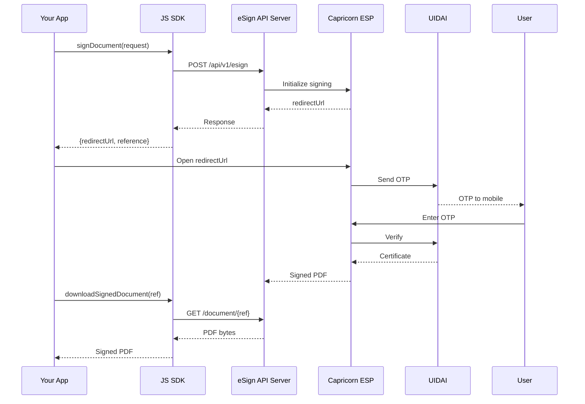

# JavaScript SDK Complete Guide

Complete integration guide for the eSign JavaScript SDK.

---

## Overview

The eSign JavaScript SDK provides a simple, promise-based API for integrating Aadhaar-based digital signing into web applications.

### Features

- ✅ **Browser & Node.js** - Works in both environments
- ✅ **TypeScript Support** - Full type definitions included
- ✅ **Promise-based** - Modern async/await syntax
- ✅ **Builder Pattern** - Fluent API for requests
- ✅ **Zero Dependencies** - No external dependencies (browser)
- ✅ **5 Auth Modes** - OTP, Biometric, Iris, Face, eKYC

---

## Architecture



!!! warning "Server Required"
    The SDK is a client library. You must deploy the **eSign API server** on your backend.

---

## Installation

### Browser

```html
<!-- Option 1: Local file -->
<script src="path/to/esign-sdk.min.js"></script>

<!-- Option 2: CDN (if available) -->
<script src="https://cdn.example.com/esign-sdk.min.js"></script>
```

### Node.js

```bash
npm install @capricorn/esign-sdk
```

```javascript
// CommonJS
const { ESignClient, ESignRequest, ESignMode } = require('@capricorn/esign-sdk');

// ES Modules
import { ESignClient, ESignRequest, ESignMode } from '@capricorn/esign-sdk';
```

### TypeScript

TypeScript definitions are included. No additional installation needed.

```typescript
import { 
    ESignClient, 
    ESignRequest, 
    SigningOptions,
    ESignMode,
    SignDocumentResponse 
} from '@capricorn/esign-sdk';
```

---

## API Reference

### ESignClient

The main client class for interacting with the eSign API.

#### Constructor

```javascript
const client = new ESignClient({
    apiBaseUrl: string,    // Required - Your eSign API server URL
    token: string,         // Required - API token from Capricorn
    key: string,           // Required - API key from Capricorn
    timeout: number        // Optional - Request timeout in ms (default: 60000)
});
```

#### Methods

| Method | Returns | Description |
|--------|---------|-------------|
| `signDocument(request)` | `Promise<SignDocumentResponse>` | Initiate document signing |
| `getStatus(reference)` | `Promise<StatusResponse>` | Get signing status |
| `downloadSignedDocument(ref)` | `Promise<ArrayBuffer\|Buffer>` | Download as bytes |
| `downloadSignedDocumentBase64(ref)` | `Promise<string>` | Download as Base64 |
| `downloadSignedDocumentBlob(ref)` | `Promise<Blob>` | Download as Blob (browser) |
| `checkHealth()` | `Promise<HealthResponse>` | Check API health |

---

### ESignRequest

Builder class for creating signing requests.

```javascript
const request = new ESignRequest()
    .pdf64(string)              // Base64 encoded PDF (required*)
    .pdfUrl(string)             // URL to fetch PDF (required*)
    .title(string)              // Document title (required)
    .mode(ESignMode)            // Authentication mode (required)
    .signerName(string)         // Signer name (required)
    .txn(string)                // Transaction ID (optional)
    .ekycId(string)             // eKYC ID (required for eKYC mode)
    .callbackUrl(string)        // Webhook URL (optional)
    .options(SigningOptions)    // Signing options (optional)
    .build();                   // Validate and build

// * Either pdf64 OR pdfUrl is required
```

---

### SigningOptions

Builder class for configuring signature appearance.

```javascript
const options = new SigningOptions()
    // Position (x1, y1, x2, y2) - origin at bottom-left
    .coordinates(350, 50, 550, 120)
    
    // Or as string
    .coordinates('350,50,550,120')
    
    // Page selection
    .pageNum('1')           // Specific page
    .pageNum('1-3')         // Range
    .pageNum('1,3,5')       // Multiple pages
    .allPages()             // All pages
    .firstPage()            // First page only
    .lastPage()             // Last page only
    
    // Signature text
    .reason('Digital Signature')
    .location('India')
    .customText('Approved')
    
    // Appearance
    .greenTicked(true)      // Show ✓ icon
    .showGreenTick()        // Same as above
    .hideGreenTick()        // Hide ✓ icon
    .dateFormat('dd-MMM-yyyy hh:mm a')
    
    // PDF protection
    .lockPdf(LockMode.NO_LOCK)
    
    .build();
```

---

### ESignMode

Authentication modes enum.

| Mode | Value | Description | Requirements |
|------|-------|-------------|--------------|
| `ESignMode.OTP` | `online-aadhaar-otp` | OTP authentication | None |
| `ESignMode.BIO` | `online-aadhaar-bio` | Fingerprint | Biometric device |
| `ESignMode.FINGERPRINT` | `online-aadhaar-bio` | Alias for BIO | Biometric device |
| `ESignMode.IRIS` | `online-aadhaar-iris` | Iris scan | Iris scanner |
| `ESignMode.FACE` | `online-aadhaar-face` | Face recognition | Camera |
| `ESignMode.CAPRICORN_EKYC` | `capricorn-ekyc-account` | Pre-verified KYC | `ekycId` |

#### Helper Methods

```javascript
// Check if mode requires eKYC ID
ESignMode.requiresEkycId(ESignMode.CAPRICORN_EKYC);  // true

// Check if mode requires device
ESignMode.requiresDevice(ESignMode.BIO);  // true

// Get eSign specification version
ESignMode.getVersion(ESignMode.OTP);  // "2.1"
ESignMode.getVersion(ESignMode.CAPRICORN_EKYC);  // "3.2"

// Parse mode from string
ESignMode.fromString('otp');  // ESignMode.OTP
```

---

### LockMode

PDF protection modes.

| Mode | Value | Description |
|------|-------|-------------|
| `LockMode.NO_LOCK` | `n` | Allow modifications |
| `LockMode.CERTIFIED` | `y` | No changes allowed |
| `LockMode.CERTIFIED_FORM_FILLING` | `cf` | Allow form filling only |
| `LockMode.CERTIFIED_FORM_ANNOTATIONS` | `cfa` | Allow forms & annotations |
| `LockMode.SIGNATURE_LOCK` | `ym` | Lock signature dictionary |

---

### ESignUtils

Utility functions for common operations.

```javascript
// Convert File to Base64 (browser only)
const base64 = await ESignUtils.fileToBase64(file);

// Convert Base64 to Blob (browser only)
const blob = ESignUtils.base64ToBlob(base64, 'application/pdf');

// Download Blob as file (browser only)
ESignUtils.downloadBlob(blob, 'document.pdf');

// Open PDF in new tab (browser only)
ESignUtils.openPdfInNewTab(blob);

// Generate unique transaction ID
const txnId = ESignUtils.generateTxnId();
// Returns: "TXN-1704067200000-abc123xyz"
```

---

### Response Objects

#### SignDocumentResponse

```javascript
{
    success: true,
    requestId: "REQ-123456",
    date: "2025-12-15T10:30:00",
    txn: "TXN-1704067200000",
    reference: "ESP-ABC123XYZ",
    redirectUrl: "https://esign.capricorn.com/auth?ref=ESP-ABC123XYZ",
    getSignedDocUrl: "https://api.example.com/document/ESP-ABC123XYZ"
}
```

#### StatusResponse

```javascript
{
    reference: "ESP-ABC123XYZ",
    txn: "TXN-1704067200000",
    status: "COMPLETED",  // PENDING | IN_PROGRESS | COMPLETED | FAILED | CANCELLED
    signerName: "John Doe",
    createdAt: "2025-12-15T10:30:00",
    updatedAt: "2025-12-15T10:35:00",
    completedAt: "2025-12-15T10:35:00",
    getSignedDocUrl: "https://api.example.com/document/ESP-ABC123XYZ",
    
    // Helper methods
    isCompleted(): boolean,
    isPending(): boolean,
    isFailed(): boolean
}
```

---

## Coordinate System

The PDF coordinate system uses points (1 point = 1/72 inch) with origin at bottom-left.

```
(0, 842) ─────────────────────────────── (595, 842)
    │              TOP                        │
    │                                         │
    │   A4 Page: 595 x 842 points             │
    │                                         │
    │        ┌─────────────┐                  │
    │        │  Signature  │                  │
    │        │  (x1,y1)    │                  │
    │        │    to       │                  │
    │        │  (x2,y2)    │                  │
    │        └─────────────┘                  │
    │              BOTTOM                     │
(0, 0) ───────────────────────────────── (595, 0)
```

### Common Signature Positions

| Position | Coordinates | Usage |
|----------|-------------|-------|
| Bottom-right | `400,50,550,120` | Most common |
| Bottom-left | `50,50,200,120` | Alternative |
| Bottom-center | `200,50,400,120` | Centered |
| Top-right | `400,750,550,820` | Header area |
| Top-left | `50,750,200,820` | Header area |

---

## Complete Examples

### Example 1: Basic OTP Signing

```javascript
const { ESignClient, ESignRequest, ESignMode, ESignUtils } = ESignSDK;

// Initialize client
const client = new ESignClient({
    apiBaseUrl: 'https://your-api.com',
    token: 'your-token',
    key: 'your-key'
});

async function signWithOTP(pdfFile, signerName) {
    // Convert file to Base64
    const pdf64 = await ESignUtils.fileToBase64(pdfFile);
    
    // Create and send request
    const response = await client.signDocument(
        new ESignRequest()
            .pdf64(pdf64)
            .title('Contract Agreement')
            .mode(ESignMode.OTP)
            .signerName(signerName)
    );
    
    console.log('Reference:', response.reference);
    
    // Open OTP authentication page
    window.open(response.redirectUrl, '_blank');
    
    return response.reference;
}
```

### Example 2: eKYC Mode Signing

```javascript
async function signWithEKYC(pdf64, signerName, ekycId) {
    const response = await client.signDocument(
        new ESignRequest()
            .pdf64(pdf64)
            .title('KYC Document')
            .mode(ESignMode.CAPRICORN_EKYC)
            .ekycId(ekycId)  // Required for eKYC mode!
            .signerName(signerName)
    );
    
    return response;
}
```

### Example 3: Custom Signing Options

```javascript
const options = new SigningOptions()
    .coordinates(50, 700, 250, 780)  // Top-left
    .lastPage()
    .reason('Approved by Manager')
    .location('Mumbai, India')
    .customText('Final Approval')
    .showGreenTick()
    .dateFormat('dd-MMM-yyyy hh:mm a')
    .lockPdf(LockMode.CERTIFIED);

const response = await client.signDocument(
    new ESignRequest()
        .pdf64(pdf64)
        .title('Approval Document')
        .mode(ESignMode.OTP)
        .signerName('Manager Name')
        .options(options)
);
```

### Example 4: Status Polling

```javascript
async function waitForCompletion(reference, maxAttempts = 20) {
    for (let i = 0; i < maxAttempts; i++) {
        const status = await client.getStatus(reference);
        
        console.log(`Attempt ${i + 1}: ${status.status}`);
        
        if (status.isCompleted()) {
            return status;
        }
        
        if (status.isFailed()) {
            throw new Error('Signing failed');
        }
        
        // Wait 3 seconds before next check
        await new Promise(r => setTimeout(r, 3000));
    }
    
    throw new Error('Timeout waiting for completion');
}

// Usage
const status = await waitForCompletion(response.reference);
console.log('Signing completed!');
```

### Example 5: Download Signed PDF

```javascript
// Browser - Download as file
async function downloadSignedPdf(reference, filename) {
    const blob = await client.downloadSignedDocumentBlob(reference);
    ESignUtils.downloadBlob(blob, filename);
}

// Browser - Open in new tab
async function viewSignedPdf(reference) {
    const blob = await client.downloadSignedDocumentBlob(reference);
    ESignUtils.openPdfInNewTab(blob);
}

// Node.js - Save to file
const fs = require('fs');

async function saveSignedPdf(reference, filepath) {
    const buffer = await client.downloadSignedDocument(reference);
    fs.writeFileSync(filepath, Buffer.from(buffer));
}
```

### Example 6: Complete Browser Implementation

```html
<!DOCTYPE html>
<html>
<head>
    <title>eSign Document Signing</title>
    <style>
        body { font-family: Arial, sans-serif; max-width: 600px; margin: 50px auto; }
        .form-group { margin-bottom: 15px; }
        label { display: block; margin-bottom: 5px; }
        input, select { width: 100%; padding: 8px; }
        button { padding: 10px 20px; background: #4f46e5; color: white; border: none; cursor: pointer; }
        button:hover { background: #4338ca; }
        .result { margin-top: 20px; padding: 15px; background: #f0f0f0; border-radius: 4px; }
    </style>
</head>
<body>
    <h1>Document Signing</h1>
    
    <div class="form-group">
        <label>Select PDF File</label>
        <input type="file" id="pdfFile" accept=".pdf">
    </div>
    
    <div class="form-group">
        <label>Signer Name</label>
        <input type="text" id="signerName" placeholder="Enter your name">
    </div>
    
    <div class="form-group">
        <label>Authentication Mode</label>
        <select id="authMode">
            <option value="online-aadhaar-otp">OTP</option>
            <option value="online-aadhaar-bio">Biometric</option>
            <option value="capricorn-ekyc-account">eKYC</option>
        </select>
    </div>
    
    <button onclick="startSigning()">Sign Document</button>
    <button onclick="downloadSigned()" id="downloadBtn" style="display:none; margin-left:10px;">
        Download Signed PDF
    </button>
    
    <div id="result" class="result" style="display:none;"></div>

    <script src="esign-sdk.min.js"></script>
    <script>
    const { ESignClient, ESignRequest, SigningOptions, ESignMode, ESignUtils } = ESignSDK;

    // Initialize client
    const client = new ESignClient({
        apiBaseUrl: 'https://your-api-server.com',
        token: 'your-token',
        key: 'your-key'
    });

    let currentReference = null;

    async function startSigning() {
        try {
            const file = document.getElementById('pdfFile').files[0];
            const signerName = document.getElementById('signerName').value;
            const mode = document.getElementById('authMode').value;

            if (!file || !signerName) {
                alert('Please select a file and enter your name');
                return;
            }

            // Convert file to Base64
            const pdf64 = await ESignUtils.fileToBase64(file);

            // Create options
            const options = new SigningOptions()
                .coordinates(350, 50, 550, 120)
                .allPages()
                .reason('Digital Signature')
                .location('India')
                .showGreenTick();

            // Create request
            const request = new ESignRequest()
                .pdf64(pdf64)
                .title(file.name)
                .mode(mode)
                .signerName(signerName)
                .options(options);

            // Sign document
            const response = await client.signDocument(request);

            // Store reference
            currentReference = response.reference;
            localStorage.setItem('esign_reference', response.reference);

            // Show result
            showResult(`
                <strong>Success!</strong><br>
                Reference: ${response.reference}<br>
                <a href="${response.redirectUrl}" target="_blank">Click here to complete OTP</a>
            `);

            // Show download button
            document.getElementById('downloadBtn').style.display = 'inline-block';

            // Open authentication page
            window.open(response.redirectUrl, '_blank');

        } catch (error) {
            showResult(`<strong>Error:</strong> ${error.message}`, true);
        }
    }

    async function downloadSigned() {
        try {
            const reference = currentReference || localStorage.getItem('esign_reference');
            
            if (!reference) {
                alert('No reference found. Please sign a document first.');
                return;
            }

            // Check status first
            const status = await client.getStatus(reference);
            
            if (!status.isCompleted()) {
                alert(`Signing not complete. Status: ${status.status}`);
                return;
            }

            // Download as blob
            const blob = await client.downloadSignedDocumentBlob(reference);
            
            // Save file
            ESignUtils.downloadBlob(blob, 'signed_document.pdf');
            
            showResult('<strong>Downloaded!</strong> Check your downloads folder.');

        } catch (error) {
            showResult(`<strong>Error:</strong> ${error.message}`, true);
        }
    }

    function showResult(html, isError = false) {
        const resultDiv = document.getElementById('result');
        resultDiv.style.display = 'block';
        resultDiv.style.background = isError ? '#fee2e2' : '#dcfce7';
        resultDiv.innerHTML = html;
    }
    </script>
</body>
</html>
```

---

## Error Handling

### ESignError

```javascript
try {
    const response = await client.signDocument(request);
} catch (error) {
    if (error instanceof ESignError) {
        console.error('Code:', error.code);
        console.error('Message:', error.message);
    }
}
```

### Error Codes

| Code | Description | Solution |
|------|-------------|----------|
| `AUTH_001` | Invalid token | Check API token |
| `AUTH_002` | Invalid key | Check API key |
| `VAL_001` | Missing required field | Check request fields |
| `VAL_002` | Invalid PDF data | Verify Base64 encoding |
| `VAL_003` | Invalid mode | Use valid ESignMode |
| `VAL_004` | ekycId required | Add ekycId for eKYC mode |
| `ESP_001` | User cancelled | User cancelled signing |
| `ESP_002` | OTP verification failed | Invalid OTP entered |
| `ESP_003` | Authentication failed | Aadhaar auth failed |
| `TIMEOUT` | Request timeout | Increase timeout or retry |
| `NETWORK` | Network error | Check connectivity |

---

## Node.js Usage

### Complete Node.js Example

```javascript
const fs = require('fs');
const path = require('path');
const { ESignClient, ESignRequest, SigningOptions, ESignMode } = require('@capricorn/esign-sdk');

// Initialize client
const client = new ESignClient({
    apiBaseUrl: 'https://your-api-server.com',
    token: 'your-token',
    key: 'your-key',
    timeout: 120000  // 2 minutes
});

async function signDocument() {
    // Read PDF file
    const pdfPath = path.join(__dirname, 'document.pdf');
    const pdfBuffer = fs.readFileSync(pdfPath);
    const pdf64 = pdfBuffer.toString('base64');

    // Create options
    const options = new SigningOptions()
        .coordinates(350, 50, 550, 120)
        .allPages()
        .reason('Server-side signing')
        .location('India');

    // Create request
    const request = new ESignRequest()
        .pdf64(pdf64)
        .title('Server Document')
        .mode(ESignMode.OTP)
        .signerName('John Doe')
        .callbackUrl('https://your-server.com/webhook/esign')
        .options(options);

    // Sign
    const response = await client.signDocument(request);
    
    console.log('Reference:', response.reference);
    console.log('Redirect URL:', response.redirectUrl);
    
    // Send redirectUrl to frontend for user authentication
    return response;
}

async function downloadAndSave(reference) {
    const buffer = await client.downloadSignedDocument(reference);
    
    const outputPath = path.join(__dirname, `signed_${reference}.pdf`);
    fs.writeFileSync(outputPath, Buffer.from(buffer));
    
    console.log('Saved to:', outputPath);
}

// Run
signDocument()
    .then(response => {
        console.log('Signing initiated');
        // After user completes OTP:
        // downloadAndSave(response.reference);
    })
    .catch(console.error);
```

---

## Best Practices

### 1. Store Reference ID

Always store the `reference` ID after signing initiation:

```javascript
// Browser
localStorage.setItem('esign_ref', response.reference);

// Server
await database.save({ reference: response.reference, userId: user.id });
```

### 2. Handle Errors Gracefully

```javascript
try {
    const response = await client.signDocument(request);
} catch (error) {
    if (error.code === 'TIMEOUT') {
        // Retry with longer timeout
        client.timeout = 120000;
        return client.signDocument(request);
    }
    throw error;
}
```

### 3. Use Callback URL for Server Notifications

```javascript
const request = new ESignRequest()
    .pdf64(pdf64)
    .title('Document')
    .mode(ESignMode.OTP)
    .signerName('User')
    .callbackUrl('https://your-server.com/webhook/esign');  // Webhook
```

### 4. Validate Before Building

```javascript
// The build() method validates required fields
try {
    const request = new ESignRequest()
        .pdf64(pdf64)
        .title('Document')
        // Missing mode and signerName!
        .build();
} catch (error) {
    console.error('Validation failed:', error.message);
}
```

---

## Troubleshooting

| Problem | Cause | Solution |
|---------|-------|----------|
| CORS error | API server not configured | Enable CORS on server |
| Network timeout | Large PDF or slow network | Increase timeout, use `pdfUrl` |
| Invalid PDF error | Corrupted Base64 | Re-encode PDF properly |
| OTP page blank | WebView/popup blocked | Allow popups for domain |
| Download fails | Signing not complete | Check status first |

---

## FAQ

!!! question "Can I sign multiple documents at once?"
    No, each signing request handles one document. For bulk signing, loop through documents sequentially.

!!! question "How long is the redirect URL valid?"
    Typically 15-30 minutes. After that, create a new signing request.

!!! question "Can I use the SDK without a backend server?"
    No. The SDK is a client library that communicates with your eSign API server.

!!! question "What PDF sizes are supported?"
    Up to 10MB for Base64. For larger files, use `pdfUrl()` to have the server fetch the PDF.

---

## Version History

| Version | Date | Changes |
|---------|------|---------|
| 1.0.0 | December 2025 | Initial release |

---

**© 2025 Capricorn Technologies. All rights reserved.**
