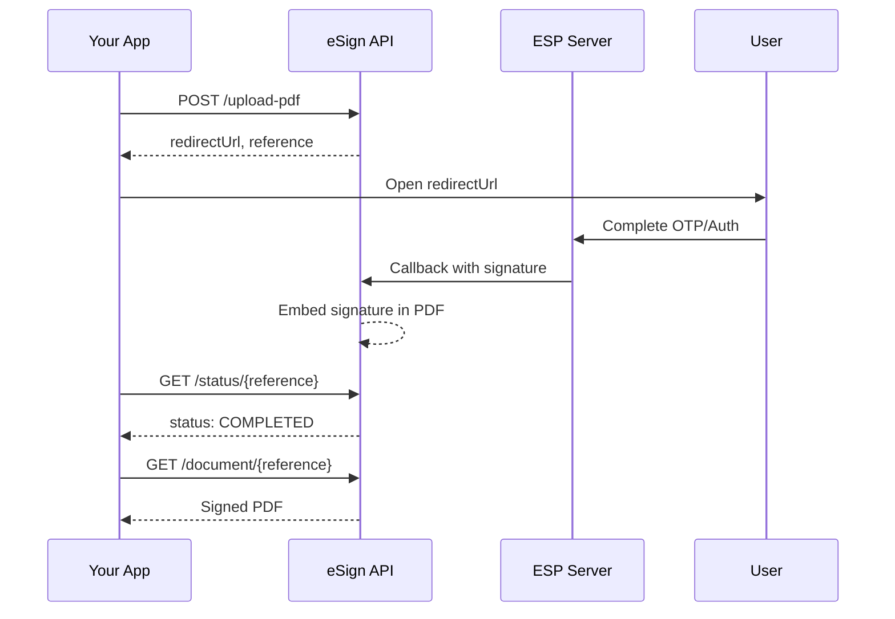

# REST API Quick Reference

Quick reference for the eSign REST API used by JavaScript SDK and Android SDK.

**Base URL:** `https://your-ngrok-url.ngrok-free.dev/api/v1/esign`

**Port:** 8081 (esign-api)

---

## Authentication

All requests require authentication headers:

```json
{
  "auth": {
    "command": "esign",
    "token": "YOUR_API_TOKEN",
    "key": "YOUR_API_KEY"
  }
}
```

---

## Endpoints Summary

| Method | Endpoint | Description |
|--------|----------|-------------|
| `POST` | `/api/v1/esign/upload-pdf` | Upload and sign a PDF |
| `GET` | `/api/v1/esign/status/{reference}` | Check signing status |
| `GET` | `/api/v1/esign/document/{reference}` | Download signed PDF |
| `GET` | `/api/v1/esign/health` | Health check |

---

## 1. Upload and Sign PDF

### `POST /api/v1/esign/upload-pdf`

Initiates the signing process.

=== "JSON Request"

    ```json
    {
      "auth": {
        "command": "esign",
        "token": "YOUR_TOKEN",
        "key": "YOUR_KEY"
      },
      "parameter": {
        "uploadpdf": {
          "pdf64": "BASE64_ENCODED_PDF",
          "title": "Document Title",
          "mode": "online-aadhaar-otp",
          "txn": "YOUR_TRANSACTION_ID",
          "signername": "Signer Name",
          "callbackurl": "https://your-server.com/callback",
          "option": {
            "cood": "350,50,550,120",
            "pagenum": "1",
            "reason": "Digital Signature",
            "location": "India",
            "greenticked": "y",
            "dateformat": "dd-MMM-yyyy hh:mm a",
            "lockpdf": "n"
          }
        }
      }
    }
    ```

=== "XML Request"

    ```xml
    <?xml version="1.0" encoding="UTF-8"?>
    <request>
      <auth>
        <command>esign</command>
        <token>YOUR_TOKEN</token>
        <key>YOUR_KEY</key>
      </auth>
      <parameter>
        <uploadpdf>
          <pdf64>BASE64_ENCODED_PDF</pdf64>
          <title>Document Title</title>
          <mode>online-aadhaar-otp</mode>
          <txn>YOUR_TRANSACTION_ID</txn>
          <signername>Signer Name</signername>
          <callbackurl>https://your-server.com/callback</callbackurl>
          <option>
            <cood>350,50,550,120</cood>
            <pagenum>1</pagenum>
            <reason>Digital Signature</reason>
            <location>India</location>
            <greenticked>y</greenticked>
            <dateformat>dd-MMM-yyyy hh:mm a</dateformat>
            <lockpdf>n</lockpdf>
          </option>
        </uploadpdf>
      </parameter>
    </request>
    ```

=== "cURL Example"

    ```bash
    curl -X POST "https://your-ngrok-url.ngrok-free.dev/api/v1/esign/upload-pdf" \
      -H "Content-Type: application/json" \
      -d '{
        "auth": {
          "command": "esign",
          "token": "YOUR_TOKEN",
          "key": "YOUR_KEY"
        },
        "parameter": {
          "uploadpdf": {
            "pdf64": "JVBERi0xLjQK...",
            "title": "Contract",
            "mode": "online-aadhaar-otp",
            "txn": "TXN123456",
            "signername": "John Doe"
          }
        }
      }'
    ```

### Success Response

```json
{
  "success": "OK",
  "command": "esign",
  "responsedata": {
    "response": {
      "txn": "TXN123456",
      "reference": "A1B2C3D4E5F6...",
      "redirecturl": "https://your-ngrok-url.ngrok-free.dev/api/v1/esign/redirect/A1B2C3D4E5F6...",
      "getsigneddocurl": "https://your-ngrok-url.ngrok-free.dev/api/v1/esign/document/A1B2C3D4E5F6..."
    }
  }
}
```

### Error Response

```json
{
  "success": "FAIL",
  "errorcode": "AUTH_001",
  "errormessage": "Invalid authentication token"
}
```

---

## 2. Check Status

### `GET /api/v1/esign/status/{reference}`

=== "cURL"

    ```bash
    curl "https://your-ngrok-url.ngrok-free.dev/api/v1/esign/status/A1B2C3D4E5F6"
    ```

### Response

```json
{
  "reference": "A1B2C3D4E5F6...",
  "status": "COMPLETED",
  "clientTxn": "TXN123456",
  "createdAt": "2025-01-06T10:30:00Z",
  "completedAt": "2025-01-06T10:35:00Z"
}
```

### Status Values

| Status | Description |
|--------|-------------|
| `PENDING` | Waiting for user to complete signing |
| `PROCESSING` | ESP response received, processing |
| `COMPLETED` | Signing completed successfully |
| `FAILED` | Signing failed |

---

## 3. Download Signed PDF

### `GET /api/v1/esign/document/{reference}`

=== "cURL"

    ```bash
    curl -o signed.pdf "https://your-ngrok-url.ngrok-free.dev/api/v1/esign/document/A1B2C3D4E5F6"
    ```

=== "Browser"

    Open URL directly in browser to download.

---

## 4. Health Check

### `GET /api/v1/esign/health`

=== "cURL"

    ```bash
    curl "https://your-ngrok-url.ngrok-free.dev/api/v1/esign/health"
    ```

### Response

```json
{
  "status": "UP"
}
```

---

## Authentication Modes

| Mode | Description | Use Case |
|------|-------------|----------|
| `online-aadhaar-otp` | OTP to registered mobile | Remote signing |
| `online-aadhaar-bio` | Fingerprint scan | In-person with device |
| `online-aadhaar-iris` | Iris scan | High security |
| `online-aadhaar-face` | Face scan | Modern biometric |
| `capricorn-ekyc-account` | Pre-verified eKYC | KYC customers |

---

## Signing Options

| Option | Values | Default | Description |
|--------|--------|---------|-------------|
| `cood` | `x1,y1,x2,y2` | `350,50,550,120` | Signature position |
| `pagenum` | `1`, `all`, `first`, `last`, `1-3`, `1,3,5` | `1` | Pages to sign |
| `reason` | String | `Digital Signature` | Signing reason |
| `location` | String | `India` | Signing location |
| `customtext` | String | - | Custom text |
| `greenticked` | `y` / `n` | `y` | Green checkmark |
| `dateformat` | Pattern | `dd-MMM-yyyy hh:mm a` | Date format |
| `lockpdf` | `n` / `y` / `cf` / `cfa` | `n` | Lock mode |

---

## Page Selection

| Value | Description |
|-------|-------------|
| `1` | First page only |
| `first` | First page |
| `last` | Last page |
| `all` | All pages |
| `1-3` | Pages 1 to 3 |
| `1,3,5` | Pages 1, 3, and 5 |

---

## PDF Lock Modes

| Value | Mode | Description |
|-------|------|-------------|
| `n` | No Lock | Allow more signatures (default) |
| `y` | Fully Locked | No changes allowed |
| `cf` | Form Filling Only | Only form fields editable |
| `cfa` | Forms + Annotations | Forms and comments allowed |

---

## Date Formats

| Format | Output |
|--------|--------|
| `dd-MMM-yyyy hh:mm a` | 06-Jan-2025 02:30 PM |
| `dd/MM/yyyy HH:mm` | 06/01/2025 14:30 |
| `yyyy-MM-dd` | 2025-01-06 |
| `MMMM dd, yyyy` | January 06, 2025 |

---

## Error Codes

### Authentication Errors

| Code | Description | Solution |
|------|-------------|----------|
| `AUTH_001` | Invalid authentication token | Check `api.auth.token` in your request matches server config |
| `AUTH_002` | Invalid authentication key | Check `api.auth.key` in your request matches server config |
| `AUTH_003` | Missing authentication | Include `auth` block in request |

### Validation Errors

| Code | Description | Solution |
|------|-------------|----------|
| `VAL_001` | Missing required field | Check all required fields are present (pdf64/pdfurl, title, mode, signername) |
| `VAL_002` | Invalid PDF data | Ensure PDF is valid and properly Base64 encoded |
| `VAL_003` | Invalid mode specified | Use valid mode: `online-aadhaar-otp`, `online-aadhaar-bio`, `online-aadhaar-iris`, `online-aadhaar-face`, or `capricorn-ekyc-account` |
| `VAL_004` | Invalid page selection | Use valid pagenum: `1`, `all`, `first`, `last`, `1-3`, or `1,3,5` |
| `VAL_005` | Invalid coordinates | Ensure cood format is `x1,y1,x2,y2` with valid numbers |
| `VAL_006` | Title too long | Title must be 50 characters or less |
| `VAL_007` | Invalid date format | Check dateformat pattern is valid |

### Transaction Errors

| Code | Description | Solution |
|------|-------------|----------|
| `TXN_DUPLICATE` | Transaction ID already used | Use a unique transaction ID (see below) |
| `TXN_NOT_FOUND` | Transaction not found | Check reference ID is correct |
| `TXN_EXPIRED` | Transaction expired | Start a new signing request |

### ESP (eSign Provider) Errors

| Code | Description | Solution |
|------|-------------|----------|
| `ESP_001` | User cancelled signing | User chose to cancel - no action needed |
| `ESP_002` | OTP verification failed | User entered wrong OTP - retry signing |
| `ESP_003` | Aadhaar authentication failed | Aadhaar verification failed - check Aadhaar details |
| `ESP_004` | ESP server unavailable | ESP server down - retry later |
| `ESP_005` | ESP callback failed | Check callback URL is accessible |
| `ESP_006` | Signature generation failed | Contact ESP provider |

### Processing Errors

| Code | Description | Solution |
|------|-------------|----------|
| `PROC_001` | PDF data required | Provide either `pdf64` or `pdfurl` |
| `PROC_002` | Unsupported authentication mode | Use supported mode for your ESP configuration |
| `PROC_003` | PDF processing failed | Check PDF is not corrupted or password protected |
| `PROC_004` | Signature embedding failed | Contact support |

### License Errors

| Code | Description | Solution |
|------|-------------|----------|
| `LIC_001` | License file not found | Place `eSignLicense` in `config/` folder |
| `LIC_002` | License expired | Contact Capricorn for license renewal |
| `LIC_003` | License invalid | Check license file is correct |

### Certificate Errors

| Code | Description | Solution |
|------|-------------|----------|
| `CERT_001` | Certificate file not found | Place `privatekey.pfx` in `config/` folder |
| `CERT_002` | Certificate password incorrect | Check `esign.certificate.password` in config |
| `CERT_003` | Certificate expired | Contact Capricorn for certificate renewal |

---

## Transaction ID Uniqueness

!!! warning "Important: Transaction IDs Cannot Be Reused"
    Once a PDF is successfully signed with a transaction ID (`txn`), that ID **cannot be used again**. This prevents duplicate signing and ensures each transaction is unique.

### How It Works

1. You send a request with `txn: "ORDER-12345"`
2. User completes signing successfully
3. Transaction `ORDER-12345` is marked as **COMPLETED**
4. Any future request with `txn: "ORDER-12345"` returns error:

```json
{
  "status": "error",
  "errorCode": "TXN_DUPLICATE",
  "errorMessage": "Transaction ID 'ORDER-12345' has already been used for a completed signing. Each transaction ID can only be used once. Please use a unique transaction ID."
}
```

### Best Practices for Transaction IDs

| Practice | Example |
|----------|---------|
| Use unique identifiers | `ORDER-12345`, `INV-2025-001`, `CONTRACT-ABC123` |
| Include timestamp | `DOC-20251215-143052-001` |
| Use UUID | `550e8400-e29b-41d4-a716-446655440000` |
| Prefix by document type | `LOAN-001`, `KYC-002`, `AGREEMENT-003` |

### Checking If Transaction ID Was Used

Before submitting, you can track used transaction IDs in your system, or handle the `TXN_DUPLICATE` error and generate a new ID.

---

## Complete Flow



---

## SDK Integration

### JavaScript SDK

```javascript
const client = new ESignClient({
  baseUrl: 'https://your-ngrok-url.ngrok-free.dev',
  token: 'YOUR_TOKEN',
  key: 'YOUR_KEY'
});

const result = await client.signDocument({
  pdfBase64: base64Pdf,
  signerName: 'John Doe',
  mode: ESignMode.AADHAAR_OTP
});

window.location.href = result.redirectUrl;
```

### Android SDK

```kotlin
val client = ESignClient.Builder()
    .baseUrl("https://your-ngrok-url.ngrok-free.dev")
    .token("YOUR_TOKEN")
    .key("YOUR_KEY")
    .build()

val request = ESignRequest.Builder()
    .pdfBase64(base64Pdf)
    .signerName("John Doe")
    .mode(ESignMode.AADHAAR_OTP)
    .build()

client.signDocument(request) { response ->
    // Open redirectUrl in WebView or browser
}
```

---

## Quick Test

```bash
# 1. Health check
curl https://your-ngrok-url.ngrok-free.dev/api/v1/esign/health

# 2. Upload PDF (replace with your values)
curl -X POST https://your-ngrok-url.ngrok-free.dev/api/v1/esign/upload-pdf \
  -H "Content-Type: application/json" \
  -d @request.json

# 3. Check status
curl https://your-ngrok-url.ngrok-free.dev/api/v1/esign/status/YOUR_REFERENCE

# 4. Download signed PDF
curl -o signed.pdf https://your-ngrok-url.ngrok-free.dev/api/v1/esign/document/YOUR_REFERENCE
```

---

**Version:** 1.0 | **For:** JavaScript SDK, Android SDK, Direct API Integration
